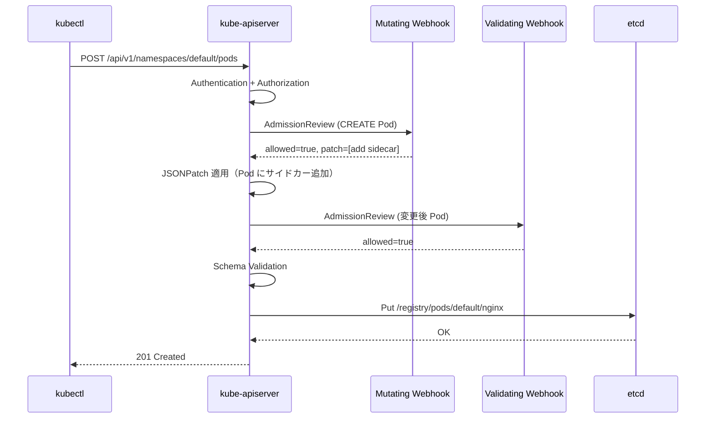

# Admission Control（アドミッションコントロール）

## 1. Admission Control とは

kube-apiserver がリクエストを受け付けてから etcd に保存するまでの間に実行される**フィルターチェーン**だ。

認証（Authentication）・認可（Authorization）の後で動作し、オブジェクトを**変更**したり**拒否**したりできる。

```
kubectl apply → kube-apiserver
                    │
                    ├─ 1. Authentication（誰か？）
                    ├─ 2. Authorization（許可されているか？）
                    ├─ 3. Admission Control ← ここ
                    │       ├─ Mutating Webhooks（変更）
                    │       ├─ Object Schema Validation（バリデーション）
                    │       └─ Validating Webhooks（検証）
                    │
                    └─ 4. etcd への書き込み
```

---

## 2. Admission Control の 2 フェーズ

### Phase 1: Mutating Admission（変更フェーズ）

オブジェクトの内容を**変更**できる。

- デフォルト値の設定（`PodSpec.DNSPolicy` など）
- サイドカーの自動注入（Istio の Envoy proxy、ロギングエージェント）
- ラベル・アノテーションの付与
- リソース制限（CPU/Memory limits）の設定

### Phase 2: Validating Admission（検証フェーズ）

オブジェクトの内容を**検証**し、拒否するかどうかを決める。変更はできない。

- ポリシー違反の検出（image が許可されたレジストリか）
- 設定の整合性チェック（ResourceQuota を超えていないか）
- セキュリティポリシーの適用（Pod Security Admission）

**なぜ 2 フェーズを分けるのか**: Mutating が先に動いて値を確定させてから、Validating が検証する。
Validating が変更できないのは「検証結果が変更によって変わる」という不整合を防ぐためだ。

---

## 3. 組み込み Admission Plugin

kube-apiserver に静的にコンパイルされたプラグイン群。

| プラグイン名 | 種類 | 機能 |
|---|---|---|
| `NamespaceLifecycle` | Validating | 削除中の Namespace へのリソース作成を拒否 |
| `LimitRanger` | Mutating + Validating | LimitRange に基づく CPU/Memory のデフォルト値設定と上限チェック |
| `ServiceAccount` | Mutating | Pod に ServiceAccount トークンを自動マウント |
| `ResourceQuota` | Validating | Namespace のリソース使用量が Quota を超えないかチェック |
| `PodSecurity` | Validating | Pod Security Standards（restricted/baseline/privileged）の適用 |
| `MutatingAdmissionWebhook` | Mutating | 動的 Webhook の呼び出し |
| `ValidatingAdmissionWebhook` | Validating | 動的 Webhook の呼び出し |
| `ValidatingAdmissionPolicy` | Validating | CEL 式による宣言的ポリシー（Webhook 不要） |

---

## 4. チェーン構造

`staging/src/k8s.io/apiserver/pkg/admission/chain.go`

```go
// chainAdmissionHandler はプラグインを順次呼び出す
type chainAdmissionHandler []Interface

func (admissionHandler chainAdmissionHandler) Admit(ctx context.Context, a Attributes, o ObjectInterfaces) error {
    for _, handler := range admissionHandler {
        if !handler.Handles(a.GetOperation()) {
            continue
        }
        if mutator, ok := handler.(MutationInterface); ok {
            err := mutator.Admit(ctx, a, o)
            if err != nil {
                return err  // 最初のエラーで即座に中断
            }
        }
    }
    return nil
}
```

```go
// Attributes インターフェース（各プラグインへの入力）
type Attributes interface {
    GetName()        string                      // リソース名
    GetNamespace()   string                      // Namespace
    GetResource()    schema.GroupVersionResource // pods, deployments...
    GetOperation()   Operation                   // CREATE, UPDATE, DELETE, CONNECT
    GetObject()      runtime.Object              // 新しいオブジェクト
    GetOldObject()   runtime.Object              // 旧オブジェクト（UPDATE 時）
    GetUserInfo()    user.Info                   // 実行ユーザー情報
    IsDryRun()       bool                        // dry-run か
}
```

---

## 5. Webhook Admission Control

動的に設定できる外部 Webhook。クラスタにデプロイした任意のサービスを Admission Controller として利用できる。

### MutatingWebhookConfiguration

```yaml
apiVersion: admissionregistration.k8s.io/v1
kind: MutatingWebhookConfiguration
metadata:
  name: my-mutating-webhook
webhooks:
  - name: inject-sidecar.example.com
    rules:
      - operations: ["CREATE"]
        resources: ["pods"]
        apiGroups: [""]
        apiVersions: ["v1"]
    clientConfig:
      service:
        name: webhook-svc
        namespace: webhook-system
        path: /mutate
      caBundle: <base64-encoded-CA>
    failurePolicy: Fail          # Webhook が応答しない場合の動作
    reinvocationPolicy: Never    # 変更後に再呼び出しするか
    admissionReviewVersions: ["v1"]
    sideEffects: None
```

### ValidatingWebhookConfiguration

```yaml
apiVersion: admissionregistration.k8s.io/v1
kind: ValidatingWebhookConfiguration
metadata:
  name: my-validating-webhook
webhooks:
  - name: validate-image.example.com
    rules:
      - operations: ["CREATE", "UPDATE"]
        resources: ["pods"]
    clientConfig:
      service:
        name: webhook-svc
        namespace: webhook-system
        path: /validate
    failurePolicy: Fail
```

---

## 6. Webhook 呼び出しの詳細フロー

`staging/src/k8s.io/apiserver/pkg/admission/plugin/webhook/mutating/dispatcher.go`

```
Mutating Webhook Dispatcher の処理:

1. AdmissionReview リクエストを構築
   （オブジェクトの JSON + 操作種別 + ユーザー情報）
     ↓
2. Webhook エンドポイントに HTTP POST
   ヘッダー: Content-Type: application/json
   ボディ: AdmissionReview (admissionregistration.k8s.io/v1)
     ↓
3. Webhook からレスポンス受信
   ├─ allowed: true  → 次の Webhook へ
   ├─ allowed: false → 即座にリクエストを拒否（message を返す）
   └─ patchType: JSONPatch + patch → オブジェクトを変更して次へ
     ↓
4. 全 Webhook を通過 → Validating フェーズへ
```

### AdmissionReview リクエスト/レスポンス

```json
// Webhook へのリクエスト
{
  "apiVersion": "admission.k8s.io/v1",
  "kind": "AdmissionReview",
  "request": {
    "uid": "705ab4f5-6393-11e8-b7cc-42010a800002",
    "kind": {"group": "", "version": "v1", "kind": "Pod"},
    "resource": {"group": "", "version": "v1", "resource": "pods"},
    "operation": "CREATE",
    "userInfo": {"username": "alice", "groups": ["system:authenticated"]},
    "object": { ... }  // Pod の JSON
  }
}

// Webhook からのレスポンス（Mutating: 変更あり）
{
  "apiVersion": "admission.k8s.io/v1",
  "kind": "AdmissionReview",
  "response": {
    "uid": "705ab4f5-...",
    "allowed": true,
    "patchType": "JSONPatch",
    "patch": "W3sib3AiOiAiYWRkIiwgInBhdGgiOiAiL3NwZWMvY29udGFpbmVycy8tIiwgInZhbHVlIjogey4uLn19XQ=="
    // base64([ {"op": "add", "path": "/spec/containers/-", "value": {...sidecar...}} ])
  }
}
```

---

## 7. Mutating の再呼び出し（Reinvocation）

Mutating Webhook が Pod を変更すると、他の Webhook が変更後の状態を見逃す可能性がある。

`reinvocationPolicy: IfNeeded` を設定すると、いずれかの Webhook がオブジェクトを変更した場合に全 Mutating Webhook を再度呼び出す。

```
Webhook-A（サイドカー注入）→ Pod 変更あり
  → reinvocationPolicy: IfNeeded なら全 Webhook を再実行
  → Webhook-B が変更後の Pod を見て追加変更
  → 変更なしになったらループを終了
```

---

## 8. ValidatingAdmissionPolicy（CEL ベースのポリシー）

Kubernetes 1.26 以降、Webhook を使わず **CEL（Common Expression Language）** でポリシーを記述できる。

```yaml
apiVersion: admissionregistration.k8s.io/v1
kind: ValidatingAdmissionPolicy
metadata:
  name: "deny-privileged-pod"
spec:
  failurePolicy: Fail
  matchConstraints:
    resourceRules:
      - operations: ["CREATE", "UPDATE"]
        resources: ["pods"]
  validations:
    - expression: "!object.spec.containers.exists(c, c.securityContext.privileged == true)"
      message: "Privileged containers are not allowed"
```

Webhook と比べた利点:
- Webhook サービスのデプロイ・管理が不要
- レイテンシが低い（外部 HTTP 呼び出しなし）
- ポリシーが Kubernetes オブジェクトとして管理できる

---

## 9. Admission Control のフロー（Mermaid）



---

## 10. failurePolicy の重要性

Webhook が応答しない・タイムアウトした場合の動作を設定する。

| failurePolicy | 動作 |
|---|---|
| `Fail`（デフォルト） | Webhook 障害時にリクエストを拒否。本番環境向け（セキュリティ優先） |
| `Ignore` | Webhook 障害時にリクエストを通過させる。Webhook 停止中でも操作できる（可用性優先）|

**注意**: `failurePolicy: Fail` の Mutating Webhook がダウンすると、
そのルールに一致する全オブジェクトの作成・更新が失敗する。
Webhook のデプロイには `namespaceSelector` で自分自身の Namespace を除外するのが必須だ。

```yaml
webhooks:
  - name: my-webhook.example.com
    namespaceSelector:
      matchExpressions:
        - key: kubernetes.io/metadata.name
          operator: NotIn
          values: ["webhook-system"]  # 自分の Namespace は除外
```

---

## 11. 設計の Why（なぜそう作られているのか）

**Q: なぜ Mutating と Validating を分けるのか？**

Mutating がオブジェクトを変更した後、Validating がその変更後の最終状態を検証できる。

Mutating と Validating が混在すると、「ある Webhook が変更したオブジェクトを、別の Webhook が変更前の状態だと思って検証する」という不整合が起きる。

フェーズを分けることで、Validating は常に「最終的なオブジェクトの状態」を検証できる。

---

**Q: なぜ Webhook が必要なのか（組み込みプラグインだけではダメなのか）？**

組み込みプラグインは apiserver のコードに静的に埋め込まれるため、追加するには Kubernetes 本体の変更とリリースが必要だ。

Webhook を使えば、クラスタ運用者が独自のポリシーを apiserver の変更なしにデプロイできる。

Istio のサイドカー注入、OPA/Gatekeeper のポリシー、企業固有のセキュリティルールなど、多様なニーズに対応できる。

---

**Q: なぜ `failurePolicy: Fail` がデフォルトなのか？**

セキュリティポリシーを実施する Webhook では、Webhook がダウンしていても「こっそり通す」のは危険だ。

`Fail` をデフォルトにすることで「Webhook が動いているうちだけポリシーが適用される」という穴を防ぐ。

運用負荷は上がるが、ポリシーの実効性を保証できる。

---

## 12. 障害・運用観点

### よくある障害パターン

| 症状 | 根本原因 | 調査コマンド |
|---|---|---|
| Pod が作成できない（`Internal error occurred: failed calling webhook`） | Mutating/Validating Webhook がダウン or タイムアウト | `kubectl get pods -n <webhook-namespace>` でポッドの状態確認 |
| Webhook が自分自身を制御して起動不能になる | Webhook の `namespaceSelector` で自 Namespace が除外されていない | `kubectl get mutatingwebhookconfigurations -o yaml` でセレクタ確認 |
| 変更が反映されない（Mutating Webhook が期待通りに動かない） | `reinvocationPolicy` の設定ミス、または Webhook が `allowed:true` のまま patch を返していない | Webhook のログを確認 + `kubectl get pod -o json` で実際の Pod を確認 |
| ValidatingAdmissionPolicy の CEL 式エラー | 式の構文エラーまたは型不一致 | `kubectl get validatingadmissionpolicy <name> -o yaml` の `status.conditions` 確認 |

### よく使う調査コマンド

```bash
# 現在登録されている Webhook の一覧
kubectl get mutatingwebhookconfigurations
kubectl get validatingwebhookconfigurations

# Webhook の詳細（ルール・failurePolicy・タイムアウト確認）
kubectl describe mutatingwebhookconfiguration <name>

# Webhook がリクエストを通しているか確認（audit log が必要）
# audit log の webhook admission の記録を確認
grep "admission webhook" /var/log/audit/audit.log

# CEL ポリシー一覧
kubectl get validatingadmissionpolicies
kubectl get validatingadmissionpolicybindings
```

### 主要 Prometheus メトリクス

| メトリクス名 | 意味 | アラート基準例 |
|---|---|---|
| `apiserver_admission_webhook_request_total` | Webhook リクエスト数（結果別） | `rejected` が急増でアラート |
| `apiserver_admission_webhook_admission_duration_seconds_bucket` | Webhook のレイテンシ分布 | p99 > 1s でアラート（タイムアウトリスク）|
| `apiserver_admission_step_admission_duration_seconds_bucket` | Admission フェーズ全体のレイテンシ | p99 > 2s でアラート |
| `apiserver_admission_webhook_fail_open_count` | `failurePolicy: Ignore` で通過したリクエスト数 | > 0 でアラート（ポリシーバイパスが起きている）|

---

## 参照ソース

| ファイル | 内容 |
|---|---|
| `staging/src/k8s.io/apiserver/pkg/admission/interfaces.go` | Attributes・MutationInterface・ValidationInterface 定義 |
| `staging/src/k8s.io/apiserver/pkg/admission/chain.go` | チェーン実行ロジック |
| `staging/src/k8s.io/apiserver/pkg/admission/plugin/webhook/mutating/dispatcher.go` | Mutating Webhook 呼び出し実装 |
| `staging/src/k8s.io/apiserver/pkg/admission/plugin/webhook/mutating/plugin.go` | Mutating Webhook プラグイン |
