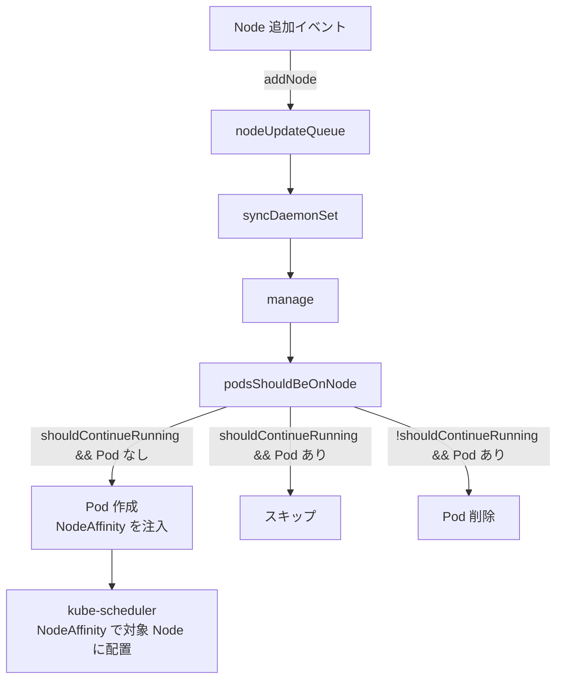

# DaemonSet

## 1. DaemonSet の存在意義

DaemonSet は「全ノードに必ず 1 つの Pod を動かす」という保証を提供する。

典型的なユースケース：
- **ログ収集エージェント**（Fluentd, Filebeat）— 全ノードのログを収集する
- **監視エージェント**（Prometheus node-exporter, Datadog agent）— 全ノードのメトリクス収集
- **ネットワークプラグイン**（Calico, Cilium）— 全ノードにネットワーク設定を適用
- **ストレージプラグイン**（Ceph, GlusterFS）— 全ノードにストレージデーモンを配置

```
Node-1  Node-2  Node-3  Node-4（新規追加）
  |       |       |         |
fluentd fluentd fluentd  fluentd（自動作成）
```

新しい Node がクラスタに参加すると、DaemonSet の Pod が**自動的に**作成される。Node が削除されると Pod も削除される。

---

## 2. 型定義

`staging/src/k8s.io/api/apps/v1/types.go`

```go
type DaemonSetSpec struct {
    Selector        *metav1.LabelSelector  // Pod を選択するラベルセレクタ
    Template        v1.PodTemplateSpec     // Pod のテンプレート
    UpdateStrategy  DaemonSetUpdateStrategy // OnDelete | RollingUpdate
    MinReadySeconds int32                   // Ready 判定の最小秒数
    RevisionHistoryLimit *int32             // 保持リビジョン数（デフォルト 10）
}

type DaemonSetUpdateStrategy struct {
    Type          DaemonSetUpdateStrategyType  // "OnDelete" | "RollingUpdate"
    RollingUpdate *RollingUpdateDaemonSet      // RollingUpdate の詳細設定
}

type RollingUpdateDaemonSet struct {
    MaxUnavailable *intstr.IntOrString  // 同時に利用不可にできる Pod 数（デフォルト 1）
    MaxSurge       *intstr.IntOrString  // 同時に余分に作れる Pod 数
}
```

---

## 3. Node 追加時の自動配置

DaemonSet Controller は Node の変化を監視し、新しい Node が追加されたときに Pod を作成する。

`pkg/controller/daemon/daemon_controller.go`

```go
nodeInformer.Informer().AddEventHandler(cache.ResourceEventHandlerFuncs{
    AddFunc: func(obj interface{}) {
        dsc.addNode(logger, obj)    // ← Node 追加イベント
    },
    UpdateFunc: func(oldObj, newObj interface{}) {
        dsc.updateNode(logger, oldObj, newObj)  // ← Node 更新イベント
    },
})

func (dsc *DaemonSetsController) addNode(logger klog.Logger, obj interface{}) {
    node, _ := obj.(*v1.Node)
    dsc.nodeUpdateQueue.Add(node.Name)  // nodeUpdateQueue に追加
}
```

Node の変化（Labels / Taints の変更）だけを監視し、それ以外の変化は無視する最適化:

```go
func shouldIgnoreNodeUpdate(oldNode, curNode v1.Node) bool {
    return apiequality.Semantic.DeepEqual(oldNode.Labels, curNode.Labels) &&
        apiequality.Semantic.DeepEqual(oldNode.Spec.Taints, curNode.Spec.Taints)
}
```

---

## 4. スケジューラとの協調（NodeAffinity による配置）

DaemonSet の Pod は通常のスケジューラを使って配置される（以前は直接 NodeName を指定していたが、現在は NodeAffinity 方式に変更された）。

Controller が Pod テンプレートの NodeAffinity を書き換えることで、特定のノードに Pod を誘導する：

```go
podTemplate.Spec.Affinity = util.ReplaceDaemonSetPodNodeNameNodeAffinity(
    podTemplate.Spec.Affinity, nodesNeedingDaemonPods[ix])
```

この設計の利点：
- スケジューラの**リソースチェック**（CPU・メモリ不足の回避）が機能する
- スケジューラの**拡張ポイント**（プラグイン）が適用される
- Node が NotReady でも Toleration で Pod を配置できる

---

## 5. 配置判定（podsShouldBeOnNode）

各 Node に対して「Pod を置くべきか」「既存の Pod を削除すべきか」を判定する。

```
全 Node をループ:
    podsShouldBeOnNode(node, nodeToDaemonPods, ds)
        │
        ├─ shouldContinueRunning: NodeSelector/Affinity/Taints を評価
        ├─ exists: その Node に既に Pod があるか
        │
        ├─ shouldContinueRunning && !exists  → nodesNeedingDaemonPods に追加
        ├─ shouldContinueRunning && exists   → 余分な Pod を削除候補に追加
        └─ !shouldContinueRunning && exists  → 全 Pod を削除候補に追加
```

**NodeSelector と Tolerations の連携**:
- `spec.template.spec.nodeSelector` — 特定のラベルを持つ Node だけに配置
- `spec.template.spec.tolerations` — Taint が付いた Node にも配置（コントロールプレーンへの配置など）

---

## 6. syncDaemonSet の処理フロー

```
syncDaemonSet(key)
    │
    ├─ DaemonSet を Lister から取得
    ├─ Node リストを取得（全 Node）
    ├─ ControllerRevision を取得・更新（updateRevision/currentRevision 決定）
    │
    └─ updateDaemonSet(ds, nodeList, hash, key, old)
            │
            ├─ manage(ds, nodeList, hash)
            │       │
            │       ├─ getNodesToDaemonPods()     Node → Pod のマッピング作成
            │       ├─ podsShouldBeOnNode()        各 Node の要/不要を判定
            │       └─ syncNodes()                 Pod を作成・削除
            │               │
            │               ├─ 並列 Pod 作成（SlowStart バッチ）
            │               └─ 並列 Pod 削除
            │
            └─ rollingUpdate(ds, nodeList, hash)   更新戦略の適用
                    │
                    └─ update.go の rollingUpdate()
```

---

## 7. RollingUpdate（ローリングアップデート）

`pkg/controller/daemon/update.go`

DaemonSet の RollingUpdate は `maxUnavailable` で同時に更新できる Node 数を制御する。

```
maxUnavailable=1 の場合（Node 4 台）:

1. Node-1 の古い Pod を削除
2. Node-1 に新しい Pod を起動
3. 新 Pod が Ready になったら次へ
4. Node-2 の古い Pod を削除
...
```

更新処理の判断:
1. 各 Node の Pod が最新の `updateRevision` のテンプレートで動いているか確認
2. 古いバージョンの Pod のうち、`maxUnavailable` の範囲内で削除
3. 削除後、次の sync サイクルで新 Pod が `manage()` によって作成される

**OnDelete** の場合: 自動更新なし。ユーザーが手動で Pod を削除したときだけ新バージョンで再作成。

---

## 8. DaemonSet と NodeAffinity の違い

| 手法 | 動作 | 自動追随 |
|---|---|---|
| DaemonSet | 全ノード（条件付き）に 1 Pod ずつ | あり（Node 増減に追随） |
| NodeAffinity（Deployment） | 指定条件に一致するノードに優先配置 | なし（replicas が固定） |
| NodeSelector（Deployment） | 指定ラベルのノードのみ配置 | なし |

DaemonSet の本質は「**ノード数 = Pod 数の保証**」にある。Deployment に NodeAffinity を設定しても、replicas が固定のため新規 Node への自動配置は保証されない。

---

## 9. BurstReplicas による レート制限

大量の Node が同時に追加された場合（クラスタ初期起動など）、一度に作成する Pod 数を制限する。

```go
const BurstReplicas = 250  // 1 回の sync で最大 250 Pod を作成・削除

if createDiff > dsc.burstReplicas {
    createDiff = dsc.burstReplicas
}
```

250 を超える Node への配置は複数の sync サイクルに分散される。これにより API サーバーへの過剰なリクエストを防ぐ。

---

## 10. DaemonSet のステータス

```go
type DaemonSetStatus struct {
    CurrentNumberScheduled int32  // 現在 Pod が動いている Node 数
    NumberMisscheduled     int32  // 動いてはいけないのに動いている Node 数
    DesiredNumberScheduled int32  // Pod を動かすべき Node 数
    NumberReady            int32  // Ready な Pod がある Node 数
    UpdatedNumberScheduled int32  // 最新バージョンの Pod がある Node 数
    NumberAvailable        int32  // 利用可能な Pod がある Node 数
    NumberUnavailable      int32  // 利用不可な Pod がある Node 数
}
```

---

## 11. Node 追加時の DaemonSet Pod 自動作成（Mermaid）



---

## 12. 設計の Why（なぜそう作られているのか）

**Q: なぜ以前の NodeName 直接指定から NodeAffinity 経由に変えたのか？**

旧実装（NodeName 直接指定）はスケジューラをバイパスするため、
CPU/メモリ不足チェックが機能せず、Node がリソース枯渇するリスクがあった。
NodeAffinity 方式ではスケジューラのリソースチェック・Taint/Toleration 評価・
プラグイン拡張が全て機能し、安全な配置が保証される。

**Q: なぜ `BurstReplicas=250` という上限があるのか？**

クラスタ初期起動や大規模ノード追加で一度に数千 Pod を作成しようとすると、
API サーバーへのリクエストが集中しスローダウンが発生するため。
250 という上限を設けることで複数の sync サイクルに分散させ、API サーバーへの影響を抑える。

---

## 13. 障害・運用観点

### よくある障害パターン

| 症状 | 根本原因 | 調査コマンド |
|---|---|---|
| 特定 Node で Pod が起動しない | Node の Taint と Pod の Toleration が一致しない | `kubectl describe node <node>` で Taint 確認、DaemonSet の tolerations 確認 |
| RollingUpdate が止まる | 古い Pod が Terminating のまま停止している | `kubectl get pods -o wide` で Terminating 確認、`kubectl describe pod <pod>` |
| 新規 Node に Pod が自動作成されない | NodeSelector/NodeAffinity の条件を満たさない | `kubectl describe node <node>` のラベル確認、DaemonSet の nodeSelector 確認 |
| 想定外の Node に Pod が起動している | `NumberMisscheduled` > 0（Taint が後から追加された等） | `kubectl get ds` で `MISSCHEDULED` 列確認 |

### よく使う調査コマンド

```bash
# DaemonSet の状態確認
kubectl describe daemonset <name>

# 全 Node での Pod 配置状況確認
kubectl get pods -o wide -l <daemonset-selector>

# 特定 Node の Taint 確認
kubectl describe node <node-name> | grep Taint

# DaemonSet のロールアウト状態
kubectl rollout status daemonset/<name>

# Node に DaemonSet Pod がない原因調査
kubectl describe node <node-name>
```

### 主要 Prometheus メトリクス

| メトリクス名 | 意味 | アラート基準例 |
|---|---|---|
| `kube_daemonset_status_number_unavailable` | 利用不可な Pod がある Node 数 | > 0 が長時間続くでアラート |
| `kube_daemonset_status_desired_number_scheduled` | Pod を配置すべき Node 数 | 急変でアラート |
| `kube_daemonset_status_number_misscheduled` | 不要な Node で Pod が動いている数 | > 0 でアラート |
| `kube_daemonset_updated_number_scheduled` | 最新バージョンで動いている Node 数 | `desired_number_scheduled` との差が長時間続くなら更新が止まっている |

---

## 参照ソース

| ファイル | 内容 |
|---|---|
| `pkg/controller/daemon/daemon_controller.go` | DaemonSetsController 定義・syncDaemonSet フロー |
| `pkg/controller/daemon/update.go` | RollingUpdate 実装 |
| `staging/src/k8s.io/api/apps/v1/types.go` | DaemonSet 型定義 |
