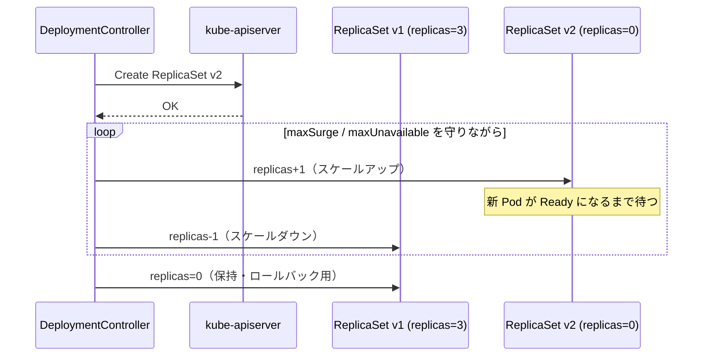

# Deployment / ReplicaSet

## 1. 一言で言うと

**Deployment** は「望ましい状態」を宣言し、**ReplicaSet** がその実現を担う二層構造。

```
Deployment（宣言）
  └── ReplicaSet（現在の世代）  ← replicas: 3
        ├── Pod
        ├── Pod
        └── Pod
  └── ReplicaSet（旧世代、replicas: 0）  ← ローリングアップデート後も残る
```

Deployment は「何をどのくらい動かすか」を表現し、ReplicaSet は「Pod をちょうど N 台維持する」ことに専念する。この責務分離が設計の核心。

---

## 2. リソースの型定義

### Deployment

```
staging/src/k8s.io/api/apps/v1/types.go
```

主要フィールド:

| フィールド | 役割 |
|---|---|
| `Spec.Replicas` | 望ましい Pod 数（デフォルト 1） |
| `Spec.Selector` | 管理する Pod を特定する LabelSelector |
| `Spec.Template` | 作成する Pod の雛形（PodTemplateSpec） |
| `Spec.Strategy` | 更新戦略（RollingUpdate / Recreate） |
| `Spec.RevisionHistoryLimit` | 保持する旧 ReplicaSet 数（デフォルト 10） |
| `Status.Replicas` | 現在存在する Pod 数 |
| `Status.ReadyReplicas` | Ready 状態の Pod 数 |
| `Status.UpdatedReplicas` | 新しい世代の Pod 数 |

### RollingUpdateDeployment（更新戦略パラメータ）

| フィールド | 意味 |
|---|---|
| `MaxUnavailable` | 更新中に許容する不足 Pod 数（数値 or %、デフォルト 25%） |
| `MaxSurge` | 望ましい数を超えて一時的に作れる追加 Pod 数（デフォルト 25%） |

### ReplicaSet

Deployment から自動生成される。`pod-template-hash` ラベルで世代を識別。

| フィールド | 役割 |
|---|---|
| `Spec.Replicas` | 維持すべき Pod 数（Deployment が書き換える） |
| `Spec.Selector` | `pod-template-hash` を含む LabelSelector |
| `Status.Replicas` | 実際に存在する Pod 数 |
| `Status.ReadyReplicas` | Ready な Pod 数 |

---

## 3. コントローラの二層構造

```
kube-controller-manager
  ├── DeploymentController
  │     │  監視: Deployment / ReplicaSet / Pod
  │     │  役割: ReplicaSet の replicas を書き換える
  │     └── pkg/controller/deployment/deployment_controller.go
  │
  └── ReplicaSetController
        │  監視: ReplicaSet / Pod
        │  役割: Pod を作成・削除して replicas に合わせる
        └── pkg/controller/replicaset/replica_set.go
```

**設計の理由**: Deployment はあくまで ReplicaSet の `replicas` を増減させるだけで、Pod の直接管理は行わない。Pod のライフサイクルは ReplicaSet に委ねる。この分離により、ReplicaSet 単体でも利用できる汎用性が生まれる。

---

## 4. Deployment Controller の動作

### 起動・イベント登録

```
pkg/controller/deployment/deployment_controller.go
```

DeploymentController は 3 種類の Informer を監視:

```
Deployment Informer  → Add/Update/Delete → enqueueDeployment()
ReplicaSet Informer  → Add/Update/Delete → ControllerRef を辿って enqueueDeployment()
Pod Informer         → Delete のみ       → Recreate 戦略のとき全 Pod 消滅を検知
```

**なぜ ReplicaSet と Pod も監視するか**: Deployment が操作するのは ReplicaSet だが、ReplicaSet が変化した（例: 手動で replicas を変えた）ときも Deployment を reconcile する必要があるため。

### syncDeployment の処理フロー

```
syncDeployment(dKey)
  ↓
1. Deployment を Lister から取得
  ↓
2. 全 ReplicaSet を取得（ControllerRef で紐付け）
  ↓
3. 削除中？ → syncStatusOnly（ステータス更新のみ）
  ↓
4. Paused？ → scale（手動スケール）して sync
  ↓
5. 更新戦略に応じて分岐
     ├── Recreate  → rolloutRecreate()
     └── RollingUpdate → rolloutRolling()
  ↓
6. ステータスを更新
```

---

## 5. ローリングアップデートの仕組み

```
pkg/controller/deployment/rolling.go
```

### フロー図

```
Before: Deployment replicas=3, 旧 RS (v1) replicas=3
                                新 RS (v2) replicas=0

Step 1: 新 RS を scale up（MaxSurge の範囲内）
  旧 RS: 3, 新 RS: 1  → 合計 4（surge=1）

Step 2: 新 RS の Pod が Ready になったら旧 RS を scale down
  旧 RS: 2, 新 RS: 2  → unavailable=0

Step 3: 繰り返し
  旧 RS: 0, 新 RS: 3  → 完了

After: 旧 RS (v1) は replicas=0 のまま残る（RevisionHistoryLimit 個まで）
```

### reconcileNewReplicaSet（新 RS のスケールアップ）

```go
// 目標 replicas に達したらスケール不要
if *(newRS.Spec.Replicas) == *(deployment.Spec.Replicas) {
    return false, nil
}
// MaxSurge を考慮した新しい replicas 数を計算
newReplicasCount, _ := deploymentutil.NewRSNewReplicas(deployment, allRSs, newRS)
dc.scaleReplicaSet(ctx, newRS, newReplicasCount, deployment, false)
```

### reconcileOldReplicaSets（旧 RS のスケールダウン）

MaxUnavailable の制約を守りながら旧 RS を縮小する。
新 RS に Ready な Pod が増えた分だけ旧 RS を減らす。

---

## 6. ReplicaSet Controller の動作

```
pkg/controller/replicaset/replica_set.go
```

### syncReplicaSet の処理フロー

```
syncReplicaSet(rsKey)
  ↓
1. ReplicaSet を Lister から取得
  ↓
2. filteredPods = このReplicaSetが所有するPodを取得
   （ControllerRef の UID でフィルタ）
  ↓
3. manage(filteredPods, rs)
  ↓
4. 現在の Pod 数と Spec.Replicas を比較
     ├── 不足 → Pod を差分だけ一括作成（BurstReplicas=500 上限）
     └── 超過 → Pod を差分だけ削除
  ↓
5. Status を更新
```

### Expectations の仕組み

ReplicaSet Controller は「作成・削除リクエストを送った」という期待値を記録する。
期待値が満たされるまで（Watch イベントで確認できるまで）余分な reconcile を抑制する。

```
期待値: (create: +2, delete: 0)
  ↓ Pod Add イベント × 2 を受信
  ↓ 期待値を消費
reconcile 再実行
```

**設計の理由**: API Server へのリクエストが遅延しても二重作成を防ぐ。

---

## 7. OwnerReference による親子関係

ReplicaSet は Deployment の子として作成され、`metadata.ownerReferences` に親情報を持つ。

```yaml
# ReplicaSet の ownerReferences（自動設定）
ownerReferences:
  - apiVersion: apps/v1
    kind: Deployment
    name: my-app
    uid: abc-123
    controller: true        # この OwnerRef が「管理者」
    blockOwnerDeletion: true
```

`pod-template-hash` ラベルは PodTemplate のハッシュ値で、ReplicaSet の世代識別に使用する。

---

## 8. Recreate 戦略

```
pkg/controller/deployment/recreate.go
```

1. 旧 ReplicaSet を `replicas: 0` に縮小
2. 全 Pod が消滅するのを待つ（Pod Delete イベントで検知）
3. 新 ReplicaSet を `replicas: N` に拡大

**使いどころ**: DB マイグレーションなど、旧版と新版が同時に動くと困る場合。
ダウンタイムが発生するため、通常は RollingUpdate を使う。

---

## 9. Deployment のフェーズと Condition

```
Status.Conditions:
  ├── Progressing: ローリングアップデートが進行中 or 完了
  └── Available: 最低限の Pod が Ready 状態
```

`progressDeadlineSeconds`（デフォルト 600 秒）を超えると `Progressing` が `False` になり、
`reason: ProgressDeadlineExceeded` が設定される。

---

## 10. ローリングアップデートのシーケンス（Mermaid）



---

## 11. 設計の Why（なぜそう作られているのか）

**Q: なぜ Deployment が直接 Pod を管理しないのか？**

ローリングアップデート中は旧版・新版の Pod が同時に存在するため、
各世代を独立した ReplicaSet で管理することで責務を明確に分離できるから。
Deployment は「どの ReplicaSet を何台にするか」だけを制御し、
Pod の実際の増減は ReplicaSet Controller に委ねる。
これにより ReplicaSet 単体でも汎用的に利用できる。

**Q: なぜ `pod-template-hash` を ReplicaSet 名に含めるのか？**

Pod テンプレートのハッシュから ReplicaSet を唯一識別し、
別テンプレートが偶然に同じ ReplicaSet を乗っ取る事故を防ぐため。
ハッシュが異なれば必ず異なる ReplicaSet が作られるため、世代の混在が起きない。

**Q: なぜ `RevisionHistoryLimit` で古い ReplicaSet を保持するのか？**

`replicas=0` の ReplicaSet を残すことで `kubectl rollout undo` による即時ロールバックを可能にするため。
Pod テンプレートの情報が ReplicaSet に記録されており、ロールバック時にその世代の仕様をそのまま使える。
削除してしまうとロールバック先がなくなる。

---

## 12. 障害・運用観点

### よくある障害パターン

| 症状 | 根本原因 | 調査コマンド |
|---|---|---|
| ロールアウトが途中で止まる | maxUnavailable=0, maxSurge=0 の設定ミス、または新 Pod が Ready にならない | `kubectl rollout status deployment/<name>` + `kubectl describe pod <new-pod>` |
| `ProgressDeadlineExceeded` | 600 秒（デフォルト）以内にロールアウトが完了しない | `kubectl describe deployment <name>` の Conditions 確認 |
| ロールバック方法 | — | `kubectl rollout undo deployment/<name>` または `kubectl rollout undo deployment/<name> --to-revision=N` |
| 旧 Pod が消えない（Recreate） | 旧 RS の Pod 削除が完了していない | `kubectl get pods` で Terminating 状態確認 |
| ReplicaSet が大量に残っている | `revisionHistoryLimit` が大きすぎる | `kubectl get rs` で確認し、必要なら値を下げる |

### よく使う調査コマンド

```bash
# ロールアウトの進行状況確認
kubectl rollout status deployment/<name>

# ロールアウト履歴確認
kubectl rollout history deployment/<name>

# 特定リビジョンにロールバック
kubectl rollout undo deployment/<name> --to-revision=2

# Deployment の詳細確認（Conditions / Events）
kubectl describe deployment <name>
```

### 主要 Prometheus メトリクス

| メトリクス名 | 意味 | アラート基準例 |
|---|---|---|
| `kube_deployment_status_replicas_unavailable` | 利用不可な Pod 数 | > 0 が長時間続くでアラート |
| `kube_deployment_spec_replicas` | 望ましい Pod 数 | 急変でアラート（意図しないスケール）|
| `kube_replicaset_status_ready_replicas` | Ready な Pod 数 | `spec_replicas` との差異でアラート |
| `kube_deployment_status_observed_generation` | Deployment の観測済み世代 | `metadata.generation` との差が長時間続くなら controller が機能していない |

---

## 13. コードリーディングの起点

| 処理 | ファイル |
|---|---|
| Deployment Controller 初期化 | `pkg/controller/deployment/deployment_controller.go` |
| syncDeployment | `pkg/controller/deployment/deployment_controller.go:Run()` |
| ローリングアップデート | `pkg/controller/deployment/rolling.go` |
| Recreate | `pkg/controller/deployment/recreate.go` |
| ReplicaSet スケール制御 | `pkg/controller/deployment/sync.go` |
| ReplicaSet Controller | `pkg/controller/replicaset/replica_set.go` |
| 型定義 | `staging/src/k8s.io/api/apps/v1/types.go` |
