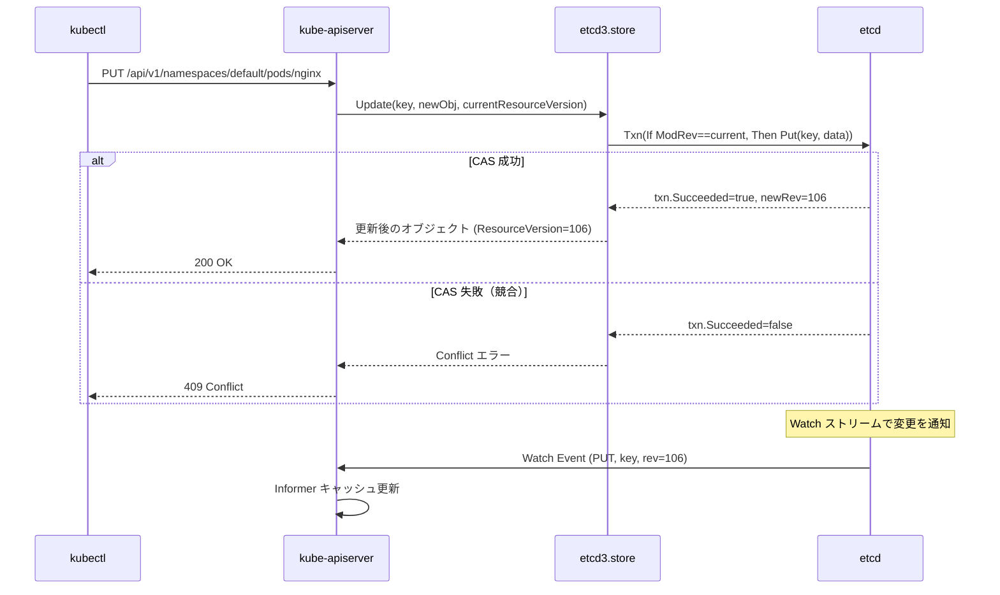

# etcd と Kubernetes の永続化レイヤー

## 1. etcd の役割

etcd は Kubernetes の**唯一の永続化ストア**だ。
kube-apiserver だけが etcd と直接通信し、他のコンポーネントは apiserver 経由でリソースを読み書きする。

```
kubectl / コントローラ / スケジューラ
        ↓
  kube-apiserver
        ↓
       etcd（すべてのリソースの Source of Truth）
```

etcd に保存されるもの：

- Pod、Deployment、Service などすべての Kubernetes オブジェクト
- Namespace・ConfigMap・Secret
- Lease（リーダーエレクション用）
- ResourceVersion（楽観的ロックの基盤）

---

## 2. MVCC（Multi-Version Concurrency Control）

etcd は MVCC を採用しており、キーの変更履歴を**リビジョン番号**で管理する。

```
key: /registry/pods/default/nginx

revision=100: {"spec": {"containers": [{"image": "nginx:1.24"}]}}
revision=105: {"spec": {"containers": [{"image": "nginx:1.25"}]}}  ← 現在の値
```

### Revision と ResourceVersion の対応

| etcd の概念 | Kubernetes の概念 | 説明 |
|---|---|---|
| `revision` | `ResourceVersion` | グローバルな変更番号（etcd 全体で単調増加） |
| `mod_revision` | オブジェクトの `ResourceVersion` | そのキーが最後に変更されたリビジョン |
| `create_revision` | — | そのキーが作成されたリビジョン |

### 楽観的ロック（CAS: Compare-And-Swap）

Kubernetes のオブジェクト更新は必ず CAS で行われる。

```go
// store.go の Update 実装イメージ
txnResp, err := s.client.KV.Txn(ctx).
    If(clientv3.Compare(clientv3.ModRevision(key), "=", currentRev)).
    Then(clientv3.OpPut(key, newData)).
    Commit()

if !txnResp.Succeeded {
    // 誰かが先に更新した → Conflict エラーを返す
    return storage.NewKeyExistsError(key, 0)
}
```

`ResourceVersion` が一致しないと更新が失敗する。
これにより「読み取り → 変更 → 書き込み」の間に他プロセスが変更した場合、競合が検出される。

---

## 3. Watch メカニズム

etcd の Watch は**特定のリビジョン以降のすべての変更を受け取る**ストリームだ。
Kubernetes の Informer はこの Watch を基盤にしている。

```go
// watcher.go より
type watcher struct {
    client       *clientv3.Client
    codec        runtime.Codec
    versioner    storage.Versioner
    transformer  value.Transformer
    // ...
}
```

### Watch のバッファリング

```go
// watcher.go の定数
incomingBufSize         = 100  // etcd → Kubernetes の受信バッファ
outgoingBufSize         = 100  // Kubernetes → クライアントの送信バッファ
processEventConcurrency = 10   // イベント処理の並列度
```

### Watch とリソースバージョン

```
クライアント: ResourceVersion=105 以降の Watch を要求
etcd: revision=106, 107, 108... を順に送信

etcd がリビジョンを Compact（削除）すると:
  "too old resource version" エラー → クライアントは全量 List から再開
```

---

## 4. kube-apiserver の Storage レイヤー構造

```
kube-apiserver
  └── REST Handler（/api/v1/pods）
        └── registry.Store（CRUD ロジック）
              └── storage.Interface（抽象化）
                    └── etcd3.store（実装）
                          └── etcd Client（gRPC）
                                └── etcd クラスタ
```

`staging/src/k8s.io/apiserver/pkg/storage/etcd3/store.go`

```go
type store struct {
    client        *kubernetes.Client   // etcd クライアント
    codec         runtime.Codec        // JSON/Protobuf シリアライザ
    versioner     storage.Versioner    // ResourceVersion 管理
    transformer   value.Transformer    // 暗号化（EncryptionConfiguration）
    pathPrefix    string               // /registry
    watcher       *watcher             // Watch ストリーム管理
    leaseManager  *leaseManager        // TTL Lease の再利用
}
```

---

## 5. etcd のキーパス設計

Kubernetes リソースは etcd に以下のパスで保存される：

```
/registry/<resource-type>/<namespace>/<name>

例:
/registry/pods/default/nginx-abc12
/registry/services/default/my-svc
/registry/deployments/production/web-app
/registry/secrets/kube-system/bootstrap-token-xxx
```

Namespace スコープのないリソース（Node など）：

```
/registry/minions/<node-name>    ← Node のパス（minions は歴史的名称）
/registry/namespaces/<name>
```

---

## 6. Compact（コンパクション）

MVCC の履歴を無限に保持するとディスクが枯渇する。
定期的な Compact でリビジョン履歴を削除する。

`staging/src/k8s.io/apiserver/pkg/storage/etcd3/compact.go`

```go
// デフォルト: 5 分ごとにコンパクション
func StartCompactorPerEndpoint(client *clientv3.Client, compactInterval time.Duration) *compactor {
    // 同じエンドポイントに対して Compactor を 1 つだけ起動する（重複防止）
    // ...
}
```

Compact によって削除されたリビジョンを Watch しようとすると、
"compacted" エラーが返り、クライアントは List + Watch の再起動が必要になる。

---

## 7. Lease Manager（TTL Lease の再利用）

Secret や ConfigMap など同じ TTL を持つキーが多数ある場合、
全キーに個別の Lease を発行すると etcd に過大な負荷がかかる。

Lease Manager は TTL が同じオブジェクトを 1 つの Lease にまとめて割り当てる：

```go
// lease_manager.go
type leaseManager struct {
    client        *clientv3.Client
    leasesByTTL   map[int64]*lease   // TTL → Lease のマップ
    // 同じ TTL のオブジェクトは同じ Lease を共有する
}
```

---

## 8. データの暗号化（EncryptionConfiguration）

`transformer` フィールドが暗号化を担う。

```yaml
# EncryptionConfiguration の例
apiVersion: apiserver.config.k8s.io/v1
kind: EncryptionConfiguration
resources:
  - resources: [secrets]
    providers:
    - aescbc:
        keys:
        - name: key1
          secret: <base64-encoded-key>
    - identity: {}  # フォールバック（平文）
```

etcd に保存されるデータは transformer によって暗号化・復号される。
etcd ファイルシステムに直接アクセスされても Secret の内容は読めない。

---

## 9. etcd クラスタの HA 構成

```
etcd クラスタ（3 ノード構成の例）

  kube-apiserver ─── etcd-0（Leader）
                  ├── etcd-1（Follower）
                  └── etcd-2（Follower）

Raft コンセンサス:
  - 書き込みは Leader が受け付けてから過半数（Quorum）に複製
  - 3 ノードなら 1 ノード障害まで耐えられる（Quorum=2）
  - 5 ノードなら 2 ノード障害まで耐えられる（Quorum=3）
```

### Linearizable Read vs Serializable Read

| 読み取りモード | 動作 | Kubernetes での使用 |
|---|---|---|
| Linearizable（デフォルト） | Leader に問い合わせて最新値を保証 | 一貫性が重要な操作（update 前の read など） |
| Serializable | 各 etcd ノードのローカル状態から読む（若干古い可能性あり） | パフォーマンス優先の場合 |

---

## 10. etcd とのフロー（Mermaid）



---

## 11. 設計の Why（なぜそう作られているのか）

**Q: なぜ kube-apiserver だけが etcd と話すのか？**

コントローラが直接 etcd に書き込むと認証・認可・Admission Control・バリデーションをバイパスできてしまう。

apiserver を唯一のゲートウェイにすることで、すべての書き込みに統一的な検証を適用できる。

また etcd クライアントの接続数が爆発的に増えることを防ぎ、etcd の負荷を最小化できる。

---

**Q: なぜ ResourceVersion（MVCC）を楽観的ロックに使うのか？**

悲観的ロック（Mutex など）では、ロックを取得したプロセスがクラッシュした場合にデッドロックが発生するリスクがある。

MVCC では競合を検出して再試行させるだけなので、プロセスのクラッシュによってロックが永続的に残ることがない。

Kubernetes のコントローラは冪等な reconcile ループを前提として設計されているため、競合による再試行コストは低い。

---

**Q: なぜ etcd キーに `/registry` プレフィックスを付けるのか？**

etcd 3 は 1 クラスタを複数アプリで共有できる。

プレフィックスを付けることで、Kubernetes 以外のアプリが使う etcd キーとの衝突を防ぐ。

また `/registry/pods/` のようなプレフィックスを Watch することで、Pod の変更だけを効率的に購読できる。

---

## 12. 障害・運用観点

### よくある障害パターン

| 症状 | 根本原因 | 調査コマンド |
|---|---|---|
| `etcdserver: mvcc: required revision has been compacted` | Watch のリビジョンが Compact で削除された（Informer が再起動される） | `etcdctl endpoint status --write-out=table` でコンパクション状態確認 |
| `etcdserver: request is too large` | 1 リクエストが 1.5MiB を超えた（大きな ConfigMap/Secret など） | `kubectl get configmap -o yaml` でサイズ確認 |
| `context deadline exceeded` のタイムアウト頻発 | etcd への書き込みが遅い（ディスク I/O 遅延・Raft レプリケーション遅延） | `etcdctl endpoint status` の dbSize と `wal_fsync_duration_seconds` 確認 |
| apiserver が起動しない | etcd への接続失敗（証明書期限切れ・エンドポイント設定ミス） | `journalctl -u kube-apiserver` で TLS エラー確認 |
| データ消失 | etcd クォーラム喪失（過半数のノードが同時にダウン） | `etcdctl member list` でメンバー状態確認 |

### よく使う調査コマンド

```bash
# etcd クラスタの状態確認
etcdctl endpoint status --write-out=table

# 特定キーの値を確認（Kubernetes オブジェクトを直接読む）
etcdctl get /registry/pods/default/nginx --print-value-only | \
  kubectl apply --dry-run=client -f -

# Watch イベントをリアルタイム確認
etcdctl watch /registry/pods/ --prefix

# etcd DB のサイズ確認（Compaction 必要かどうか）
etcdctl endpoint status --write-out=json | jq '.[].Status.dbSize'

# 手動でコンパクション（最新リビジョンを指定）
ETCDCTL_API=3 etcdctl compact $(etcdctl endpoint status --write-out json | jq '.[0].Status.header.revision')
```

### 主要 Prometheus メトリクス

| メトリクス名 | 意味 | アラート基準例 |
|---|---|---|
| `etcd_server_has_leader` | Leader が存在するか（0/1） | = 0 でアラート |
| `etcd_disk_wal_fsync_duration_seconds_bucket` | WAL fsync のレイテンシ分布 | p99 > 10ms でアラート |
| `etcd_disk_backend_commit_duration_seconds_bucket` | DB コミットのレイテンシ | p99 > 25ms でアラート |
| `etcd_mvcc_db_total_size_in_bytes` | etcd DB の合計サイズ | 8GB 超でアラート（デフォルト上限 8GB）|
| `etcd_server_quota_backend_bytes` | etcd DB の上限サイズ | DB サイズが上限の 80% 超でアラート |
| `etcd_network_peer_round_trip_time_seconds_bucket` | Raft ピア間のレイテンシ | p99 > 50ms でアラート |

---

## 参照ソース

| ファイル | 内容 |
|---|---|
| `staging/src/k8s.io/apiserver/pkg/storage/etcd3/store.go` | etcd3.store 実装（CRUD・CAS）|
| `staging/src/k8s.io/apiserver/pkg/storage/etcd3/watcher.go` | Watch ストリーム実装 |
| `staging/src/k8s.io/apiserver/pkg/storage/etcd3/compact.go` | Compaction ロジック |
| `staging/src/k8s.io/apiserver/pkg/storage/etcd3/lease_manager.go` | Lease 再利用管理 |
| `vendor/go.etcd.io/etcd/api/v3/mvccpb/kv.pb.go` | etcd MVCC キーバリュー型定義 |
