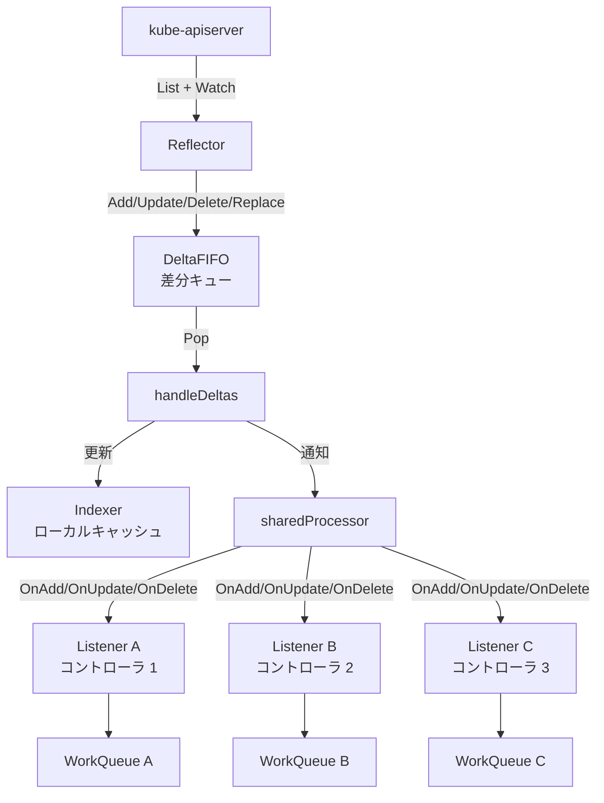

# Informer の内部実装

## 1. Informer とは何か

Informer は、Kubernetes の全コントローラが依存する「リソース監視・ローカルキャッシュ」の仕組みである。
apiserver に対して最初に一括取得（List）を行い、その後は差分ストリーム（Watch）で変更を受け取り続けることで、
**クラスタの状態をプロセス内メモリに常時最新の状態で保持する**。
コントローラはこのキャッシュを読むだけでよいため、reconcile のたびに apiserver へ問い合わせる必要がない。
また、複数のコントローラが同じリソース（例: Pod）を監視したい場合も、**SharedInformer** が Watch コネクションを1本に集約するため、apiserver への負荷が最小化される。

---

## 2. 全体処理フロー

```
                          kube-apiserver
                               |
                    List（初回フル取得）
                    Watch（以後は差分ストリーム）
                               |
                       +-------+-------+
                       |   Reflector   |   reflector.go
                       | (goroutine)   |   ListAndWatchWithContext()
                       +-------+-------+
                               |  Add/Update/Delete/Replace
                               v
                       +-------+-------+
                       |  DeltaFIFO    |   delta_fifo.go
                       | (差分キュー)  |   items: map[key]Deltas
                       +-------+-------+
                               |  Pop()
                               v
                  +------------+-------------+
                  |   handleDeltas()         |   shared_informer.go
                  | (processDeltas 経由)     |
                  +-----+----------+---------+
                        |          |
               更新      |          |  イベント通知
                        v          v
               +--------+--+   +--+------------------+
               |  Indexer  |   |   sharedProcessor   |
               | (ローカル  |   |  (リスナー群への    |
               |  キャッシュ)|  |   通知ディスパッチ)  |
               +--------+--+   +--+------------------+
                                   |
                    +--------------+--------------+
                    |              |              |
             +------+------+ +-----+-----+ +------+------+
             | Listener A  | | Listener B| | Listener C  |
             | OnAdd()     | | OnAdd()   | | OnAdd()     |
             | OnUpdate()  | | OnUpdate()| | OnUpdate()  |
             | OnDelete()  | | OnDelete()| | OnDelete()  |
             +------+------+ +-----------+ +------+------+
                    |                             |
                    v                             v
             +------+------+             +--------+------+
             |  WorkQueue  |             |  WorkQueue    |
             | (Controller A)|           | (Controller B)|
             +------+------+             +---------------+
                    |
                    v
             reconcile(key)
```

---

## 3. 各ステップの概念説明

### 3-0. 前提知識: 差分ストリーム（Watch）とは

Kubernetes の Watch は、HTTP の**長期接続**を使って変更をリアルタイムにプッシュし続ける仕組みである。

```
クライアント                       kube-apiserver
    |                                   |
    |-- GET /api/v1/pods?watch=true --> |
    |                                   |
    |  <-- {type:"ADDED",   object:Pod} |  Pod が作成された
    |  <-- {type:"MODIFIED",object:Pod} |  Pod が更新された
    |  <-- {type:"DELETED", object:Pod} |  Pod が削除された
    |  （接続は維持されたまま、変化があるたびに流れてくる）
```

通常の REST API は「リクエスト → レスポンス → 終了」だが、
Watch は**コネクションを張りっぱなし**にしてサーバーから変更をプッシュし続ける。

**なぜ Watch を使うのか**:

| 方式 | 動作 | 問題点 |
|---|---|---|
| List のみ | 定期的に全件取得 | 変化がなくても全件転送 → 重い |
| Watch のみ | 差分のみ受け取る | 接続前の状態が不明 |
| **List + Watch** | 初回フル取得後、差分だけ追従 | **Kubernetes の採用方式** |

Watch イベントには **ResourceVersion**（etcd が変更ごとに付与する単調増加の番号）が含まれる。
接続が切れても、この番号を使って「どこから再開するか」を指定できるため、途中の変更を取りこぼさない。

---

### 3-1. Reflector: APIサーバーとの接続係

Reflector は **「APIサーバーのデータを DeltaFIFO に流し込む」** 単一の責務を持つ。

**起動時の動作（初回同期）**:

```
1. listerWatcher.List() を呼び出し → 全リソースを一括取得
2. 取得した全オブジェクトを DeltaFIFO.Replace() で送る
   └── DeltaType は "Replaced"（初回 or 再接続時）
3. 取得時点の ResourceVersion を記録
```

**初回同期後の動作（Watch ループ）**:

```
4. listerWatcher.Watch(ResourceVersion) でストリーム開始
5. イベントが来るたびに DeltaFIFO.Add/Update/Delete() を呼ぶ
6. Watch が切れたら（タイムアウト or エラー）1. に戻る
   └── バックオフ付きリトライ（初期 800ms、最大 30s）
```

**ResourceVersion** とは何か:

- etcd がすべての変更に付与するグローバルな単調増加の番号
- Watch 再接続時に「どこから再開するか」を指定するためのブックマーク
- 古すぎる ResourceVersion を指定すると "expired" エラーが返り、フル再取得になる

### 3-2. DeltaFIFO: 差分を蓄積するキュー

**DeltaFIFO とは何か**:
DeltaFIFO は Reflector と Indexer の間に位置する**中継バッファ**で、
「Delta（変更の種類 + 変更後のオブジェクト）」を「FIFO（先入れ先出し）の順序」で蓄積するキューである。

```
Reflector ──(Add/Update/Delete)──► DeltaFIFO ──(Pop)──► handleDeltas → Indexer
```

名前の由来:
- **Delta** = 変更差分（Added / Updated / Deleted など）
- **FIFO**  = First In, First Out（先入れ先出し）

通常の FIFO キューは「オブジェクトそのもの」を積むが、
DeltaFIFO は **「キーごとに変更の履歴リスト（Deltas）」を積む**点が特徴。

---

**FIFO とは何か**:
FIFO は First In, First Out（先入れ先出し）の略で、**先に入れたものが先に取り出される**データ構造。

```
入れる順:   [A] → [B] → [C]
取り出し順:  A  →  B  →  C   （入れた順と同じ）
```

**なぜ FIFO を採用するのか**:
変更を**発生順に処理する**ことで一貫性を保つため。

```
FIFO の場合（正しい）:
  Pod が「作成 → 更新 → 削除」の順に発生
  → 作成を処理 → 更新を処理 → 削除を処理
  → 最終状態: Pod は存在しない ✓

LIFO（後入れ先出し）だったら（問題あり）:
  同じイベント列を逆順に処理
  → 削除を処理 → 更新を処理 → 作成を処理
  → 最終状態: Pod が存在してしまう ✗
```

DeltaFIFO は通常の FIFO と異なり、**同一オブジェクトへの複数変更を「差分リスト（Deltas）」として蓄積**する。

```
key: "default/my-pod"
  └── Deltas: [
        Delta{Type: "Added",   Object: Pod{...}},
        Delta{Type: "Updated", Object: Pod{...}},
      ]
```

**なぜ普通の FIFO ではなく Deltas にするのか**:

普通の FIFO に個別イベントを積むと、処理が遅れている間に問題が起きる。

```
普通の FIFO の場合（問題あり）:
  キュー: [Added(Pod), Updated(Pod), Deleted(Pod)]
           ↑
           worker が Added を取り出して処理中
           → Updated, Deleted はまだキューに残っている
           → 同一 Pod に対して複数 worker が並行処理する危険がある
           → 「Add された後に Delete された」という文脈が失われる
```

Deltas にすることで3つの嬉しさがある。

```
DeltaFIFO の場合（正しい）:
  キュー: ["default/my-pod"]               ← キーは1つ（重複排除）
  items:  {"default/my-pod": [Added, Updated, Deleted]}  ← 履歴は保持

  Pop() すると Deltas ごとまとめて取り出される
  → 1つの worker が Added → Updated → Deleted を順番に処理
```

1. **順序保証** — 同一オブジェクトの変更は必ず1つの worker が順番に処理する
2. **文脈の保持** — 「Add された後に Delete された」という経緯を見て処理を最適化できる（Add の処理をスキップして Delete だけ行うなど）
3. **重複排除との両立** — キーは1つに絞りつつ、変更履歴は落とさない

**DeltaType の種類**:

| DeltaType | 意味 |
|---|---|
| `Added` | オブジェクトが新規作成された |
| `Updated` | オブジェクトが変更された |
| `Deleted` | オブジェクトが削除された |
| `Replaced` | 初回 List または Watch 再接続による一括置換 |
| `Sync` | 定期 Resync（ローカルキャッシュの内容を再配信） |

**内部データ構造**:

```
DeltaFIFO
  items: map[string]Deltas   // key → 差分リスト
  queue: []string             // キーの FIFO 順序（重複なし）
```

`queue` には同じキーが**2つ入らない**。
新しいイベントが来たら `items` の Deltas に追記するだけで、`queue` の順序は変わらない。
これが「deduplication（重複排除）」の仕組み。

### 3-3. handleDeltas → Indexer 更新 + イベント通知

DeltaFIFO から Pop() されたら、`handleDeltas()` → `processDeltas()` が呼ばれる。
処理は **「1. ローカルキャッシュ更新」と「2. リスナーへの通知」の2ステップ** が必ず順番に行われる。

```
Delta.Type   | Indexer 操作     | リスナーに通知
-------------|-----------------|------------------
Added        | indexer.Add()   | OnAdd()
Updated      | indexer.Update()| OnUpdate(old, new)
Deleted      | indexer.Delete()| OnDelete()
Replaced     | indexer.Add/Update()| OnAdd() or OnUpdate()
Sync         | indexer.Update()| OnUpdate(same, same)
```

**OnUpdate での isSync 判定**:
Replaced/Sync イベントでは新旧の ResourceVersion が同じ場合がある。
この場合 `isSync = true` として、resync を要求したハンドラにのみ通知が届く。

### 3-4. Indexer: 検索可能なローカルキャッシュ

Indexer は `Store` インターフェースを拡張した、**インデックス付きのインメモリキャッシュ**。

```
Store の基本操作: Add / Update / Delete / List / Get / GetByKey

Indexer の追加機能: ByIndex(indexName, indexedValue)
  例: "namespace" インデックスで "default" の Pod を全取得
  → informer.GetIndexer().ByIndex("namespace", "default")
```

デフォルトで `namespace` インデックスが登録されており、
「特定 namespace の全オブジェクト」を O(1) で取得できる。

**コントローラはキャッシュを読む**:
reconcile 関数の中で `lister.Pods(namespace).Get(name)` を呼ぶと、
実際には Indexer のキャッシュを参照している（apiserver にはアクセスしない）。

### 3-5. sharedProcessor: 複数リスナーへの通知配信

`sharedProcessor` は **「Indexer 更新後のイベントを、登録された全リスナーに配信する」** 役割を持つ。

**なぜ sharedProcessor が必要か**:
SharedInformer には複数のコントローラ（リスナー）が `AddEventHandler()` で登録できる。
単純に「イベントが来たら全ハンドラを順番に呼ぶ」とすると、
あるハンドラが遅い場合に後続のハンドラも遅延する。
sharedProcessor はこれを避けるため、**各リスナーを独立した goroutine に分離**する。

```
handleDeltas()
  │
  ├─ Indexer 更新（同期）
  │
  └─ sharedProcessor.distribute()
       │
       ├─ listener A の channel に通知を投入（non-blocking）
       ├─ listener B の channel に通知を投入（non-blocking）
       └─ listener C の channel に通知を投入（non-blocking）

           ↓ 各 goroutine が独立して処理
       listener A goroutine: OnAdd() → WorkQueue.Add(key)
       listener B goroutine: OnAdd() → WorkQueue.Add(key)
       listener C goroutine: OnAdd() → WorkQueue.Add(key)
```

各 `processorListener` は**バッファ付きチャネル**（初期サイズ 1024）を持つ。
handleDeltas はチャネルに積むだけ（非同期）なので、遅いリスナーがいても詰まらない。
ただしバッファが溢れると古いイベントが捨てられるため、ハンドラ内の処理は軽く保つ必要がある。

**イベントハンドラ（EventHandler）でやること**:
コントローラは `AddEventHandler()` で登録するハンドラの中で、
**オブジェクトのキー（"namespace/name"）を WorkQueue に入れるだけ** にする。
重い処理は WorkQueue の worker goroutine 側で行う。

### 補足: reconcile（調整処理）とは

WorkQueue から取り出したキーを使って実際に処理を行う関数が **reconcile**（調整）である。

reconcile の責務は**「あるべき状態（desired state）と現在の状態（current state）を比較し、差分を解消すること」**。

```
reconcile("default/my-deployment") の流れ:

1. Indexer から最新状態を取得（apiserver へのアクセスなし）
   └── deployment := lister.Deployments("default").Get("my-deployment")

2. あるべき状態を確認
   └── deployment.Spec.Replicas = 3

3. 現在の状態を確認
   └── 実際に動いている ReplicaSet の Pod 数を数える → 1 台

4. 差分を解消
   └── Pod を 2 台追加する API 呼び出し

5. 結果
   └── 成功 → queue.Forget(key)
   └── 失敗 → queue.AddRateLimited(key)  ← レート制限付きでリトライ
```

**reconcile の重要な設計原則**:

- **冪等（idempotent）**: 何度呼ばれても副作用が同じ。「3台になるように調整する」であり「3台追加する」ではない
- **キャッシュを読む**: Indexer を使うため、reconcile 内で apiserver に問い合わせない（書き込みは apiserver へ）
- **キーだけ受け取る**: イベントの種類（Add/Update/Delete）は関係ない。キーを受け取ったら「今の状態を確認して合わせる」

「Delete イベントが来た」→「もう存在しないので Indexer には nothing → クリーンアップ処理を走らせる」という流れも、
同じ reconcile 関数で自然に処理できる。

### 3-6. SharedInformer の Run()

`sharedIndexInformer.RunWithContext()` が起動すると、以下の3つが並行して動き始める。

```
goroutine 1: Reflector.RunWithContext()
  └── ListAndWatchWithContext() を無限ループ
      └── DeltaFIFO に変更を積む

goroutine 2: controller.RunWithContext()（内部の Controller）
  └── DeltaFIFO.Pop() を繰り返す
      └── handleDeltas() → Indexer 更新 + sharedProcessor に通知

goroutine 3: sharedProcessor.run()
  └── 各 processorListener goroutine を起動
      └── OnAdd/OnUpdate/OnDelete をコントローラに届ける
```

---

## 4. 重要な型・インターフェース

### ResourceEventHandler

コントローラが `AddEventHandler()` に渡すインターフェース。

```go
// staging/src/k8s.io/client-go/tools/cache/controller.go
type ResourceEventHandler interface {
    OnAdd(obj interface{}, isInInitialList bool)
    OnUpdate(oldObj, newObj interface{})
    OnDelete(obj interface{})
}
```

典型的な実装では、3つのメソッドすべてで「キーを WorkQueue に追加する」だけ。

```go
// 典型的なコントローラのハンドラ登録
informer.AddEventHandler(cache.ResourceEventHandlerFuncs{
    AddFunc: func(obj interface{}) {
        key, _ := cache.MetaNamespaceKeyFunc(obj)
        queue.Add(key)   // "default/my-pod" をエンキュー
    },
    UpdateFunc: func(old, new interface{}) {
        key, _ := cache.MetaNamespaceKeyFunc(new)
        queue.Add(key)
    },
    DeleteFunc: func(obj interface{}) {
        key, _ := cache.DeletionHandlingMetaNamespaceKeyFunc(obj)
        queue.Add(key)
    },
})
```

### DeltaFIFO の中心的な型

```go
// staging/src/k8s.io/client-go/tools/cache/delta_fifo.go:216
type Delta struct {
    Type   DeltaType   // "Added" / "Updated" / "Deleted" / "Replaced" / "Sync"
    Object interface{} // 変更後のオブジェクト（Deleted の場合は削除前の最終状態）
}

type Deltas []Delta  // 古い順に並んだ差分リスト
```

### Reflector 構造体の核心フィールド

```go
// staging/src/k8s.io/client-go/tools/cache/reflector.go:106
type Reflector struct {
    listerWatcher           ListerWatcherWithContext  // List & Watch の実装
    store                   ReflectorStore            // = DeltaFIFO
    lastSyncResourceVersion string                    // Watch 再開位置
    resyncPeriod            time.Duration             // 定期 Resync 間隔
}
```

### SharedIndexInformer（実際に使われる実装）

```go
// staging/src/k8s.io/client-go/tools/cache/shared_informer.go:588
type sharedIndexInformer struct {
    indexer    Indexer          // ローカルキャッシュ（検索可能）
    controller Controller       // Reflector + DeltaFIFO ポップのラッパー
    processor  *sharedProcessor // リスナーへの通知配信
    listerWatcher ListerWatcher // apiserver への接続情報
}
```

---

## 5. よくある疑問 Q&A

**Q: Reflector の Watch が切れたらどうなる？**

Watch のタイムアウトは 5〜10 分でランダムに設定されており、切れたら `ListAndWatchWithContext()` が自動的に再呼び出しされる。
エラーの場合はバックオフ（最初 800ms、指数的に最大 30 秒）で再試行する。
再接続後は最後に記録した `ResourceVersion` から Watch を再開するため、
途中のイベントを取りこぼさない。ただし ResourceVersion が古すぎると "expired" エラーになり、再度フル List が走る。

**Q: SharedInformer の "Shared" とは何が共有されているのか？**

Watch のコネクション（1本のHTTP/2ストリーム）が共有される。
10 個のコントローラが Pod を監視したい場合、
通常なら10本の Watch コネクションが必要だが、
SharedInformer を使うと1本で済む。
`sharedProcessor` 内の複数 `processorListener` が同じDeltaFIFO から来たイベントを受け取る。

**Q: HasSynced() が false の間に reconcile が動くと問題がある？**

はい。コントローラの起動処理では必ず `cache.WaitForNamedCacheSync()` を呼んで、
Informer が初回 List を完了するまで待つ。
`HasSynced()` が true になる前は Indexer が空（または不完全）なため、
「オブジェクトが存在しないと誤判断して余計なリソースを作ってしまう」危険がある。

**Q: Resync（定期再同期）は何のためにある？**

Informer はほぼリアルタイムに更新を受け取るが、まれに通知の取りこぼしが起きうる。
Resync は「キャッシュにある全オブジェクトを Sync イベントとして再配信する」仕組みで、
コントローラが定期的に全オブジェクトを再チェックできる安全網となる。
Sync イベントは apiserver への追加アクセスを一切発生させない（キャッシュ内再配信のみ）。

**Q: Indexer に古いデータが残ることはある？**

Watch の切断直後から再接続・再 List が完了するまでの数秒間は、
Indexer の内容が古くなる可能性がある。
そのため reconcile の中でオブジェクトの最新状態が必要な場合は、
Indexer から取得した後に `resourceVersion` を確認するか、
書き込み（Update/Patch）時に conflict エラーが返ったらリトライする設計にする。

**Q: `DeletionHandlingMetaNamespaceKeyFunc` と `MetaNamespaceKeyFunc` の違いは？**

削除イベントでは `obj` が実際のオブジェクトではなく `DeletedFinalStateUnknown` でラップされている場合がある（Watch の切断中に削除が起きた場合）。
`DeletionHandlingMetaNamespaceKeyFunc` はこのケースを処理してキーを正しく取り出す。
DeleteFunc では必ずこちらを使う。

---

## 6. Reflector → DeltaFIFO → Indexer + sharedProcessor フロー（Mermaid）



---

## 7. 設計の Why（なぜそう作られているのか）

**Q: なぜ DeltaFIFO と Indexer が別々なのか？**

責務が異なるため。

- **DeltaFIFO**: 「通知の順序と差分型（Added/Updated/Deleted）」を保持し、変更の経緯を正確に追跡する
- **Indexer**: 「現在状態の高速検索」を担い、namespace などのインデックスで O(1) アクセスを提供する

両者を分離することで、それぞれが自分の責務に集中できる。

**Q: なぜ SharedInformer が必要か？**

同じリソースを複数のコントローラが Watch するとき、Watch コネクションを 1 本に集約して apiserver の負荷を最小化するため。
N 個のコントローラが各自で Watch すると N 本のコネクションが張られるが、SharedInformer を使うと 1 本で済む。
sharedProcessor が 1 本の Watch イベントを全リスナーに配信する仕組みがこれを実現する。

**Q: なぜ Resync（定期再同期）があるのか？**

Watch イベントを取りこぼした場合の安全網として機能するため。
Watch が切断・再接続される間に発生したイベントは取りこぼす可能性がある。
Resync はキャッシュにある全オブジェクトを定期的に OnUpdate で再通知し、
コントローラが取りこぼしたイベントをカバーする。apiserver への追加アクセスは発生しない。

---

## 8. 障害・運用観点

### よくある障害パターン

| 症状 | 根本原因 | 調査コマンド |
|---|---|---|
| "too old resource version" エラー | Watch の ResourceVersion が期限切れ → フル List 再取得が走る | コントローラのログで `expired` エラー確認 |
| `HasSynced` が長時間 `false` | 初期 List が大量オブジェクトにより遅延 | `reflector_list_duration_seconds` メトリクス確認 |
| コントローラが古い状態で reconcile | Watch 切断から再接続までの間に Indexer が古い状態 | write 時の conflict エラーリトライで対処済み |
| sharedProcessor のバッファ溢れ | OnAdd/OnUpdate ハンドラが重い処理をしている | ハンドラ内でキーを enqueue するだけにする |

### よく使う調査コマンド

```bash
# コントローラのログで Informer 関連エラー確認
kubectl logs -n kube-system -l component=kube-controller-manager | grep -i "watch\|list\|expired"

# Informer の同期状態確認（コントローラ起動直後）
kubectl logs -n kube-system <controller-pod> | grep "Waiting for caches"
```

### 主要 Prometheus メトリクス

| メトリクス名 | 意味 | アラート基準例 |
|---|---|---|
| `reflector_watch_duration_seconds` | Watch セッションの持続時間 | 極端に短い（short watch が多い）場合は Watch が頻繁に切断されている |
| `reflector_short_watches_total` | 短時間で切断された Watch の累計数 | 増加傾向でアラート |
| `reflector_list_duration_seconds` | 初回 List + 再接続時 List の所要時間 | p99 > 30s でアラート（大規模クラスタ） |
| `reflector_items_per_list` | 1 回の List で取得したオブジェクト数 | 急増はキャッシュ未整合の可能性 |

---

## 9. 次に読むべきファイル

### Reflector の ListAndWatch 本体

```
staging/src/k8s.io/client-go/tools/cache/reflector.go:470
  └── func (r *Reflector) ListAndWatchWithContext()
      → 初回 List の流れ、Watch ループの実装、ResourceVersion の更新
```

### DeltaFIFO の Pop と queueActionLocked

```
staging/src/k8s.io/client-go/tools/cache/delta_fifo.go:316
  └── func (f *DeltaFIFO) Pop()
      → コンシューマー（handleDeltas）に渡す処理

staging/src/k8s.io/client-go/tools/cache/delta_fifo.go
  └── func (f *DeltaFIFO) queueActionLocked()
      → Deltas への追記と queue 管理のコア実装
```

### processDeltas（Indexer 更新 + 通知の中心）

```
staging/src/k8s.io/client-go/tools/cache/controller.go
  └── func processDeltas()
      → DeltaType ごとに Indexer と EventHandler を呼び分けるスイッチ
```

### sharedIndexInformer の Run

```
staging/src/k8s.io/client-go/tools/cache/shared_informer.go:719
  └── func (s *sharedIndexInformer) RunWithContext()
      → 3 goroutine の起動と stopCh の伝播
```

### Indexer の実装（threadSafeMap）

```
staging/src/k8s.io/client-go/tools/cache/store.go
  └── threadSafeMap（Indexer の具体的実装）
      → sync.RWMutex で守られたマップ + インデックス管理
```

### SharedInformerFactory（実際のコントローラでの使われ方）

```
staging/src/k8s.io/client-go/informers/factory.go
  └── SharedInformerFactory
      → 複数 Informer を型ごとに管理し Run() を統一的に呼ぶ
      → 実際のコントローラはこれを通して Informer を取得する
```

### Deployment コントローラでの使用例

```
pkg/controller/deployment/deployment_controller.go:1
  └── NewDeploymentController()
      → podInformer.AddEventHandler() の登録方法
      → workqueue.NewRateLimitingQueue() との組み合わせ
```

---

## 補足: InformerFactory を使った全体像

実際のコントローラでは Informer を直接作成せず、`SharedInformerFactory` を経由する。

```
cmd/kube-controller-manager/
  └── controllerContext.InformerFactory  ← SharedInformerFactory
        |
        +-- podInformer    = factory.Core().V1().Pods()
        +-- nodeInformer   = factory.Core().V1().Nodes()
        +-- deployInformer = factory.Apps().V1().Deployments()
        ...

factory.Start(stopCh)  ← 登録された全 Informer の Run() を並行起動
factory.WaitForCacheSync(stopCh)  ← 全 Informer の HasSynced() を待機
```

Factory が Informer を型ごとにキャッシュするため、
複数のコントローラが `factory.Core().V1().Pods()` を呼んでも
同一の SharedInformer インスタンスが返される（Watch コネクション1本に集約）。
