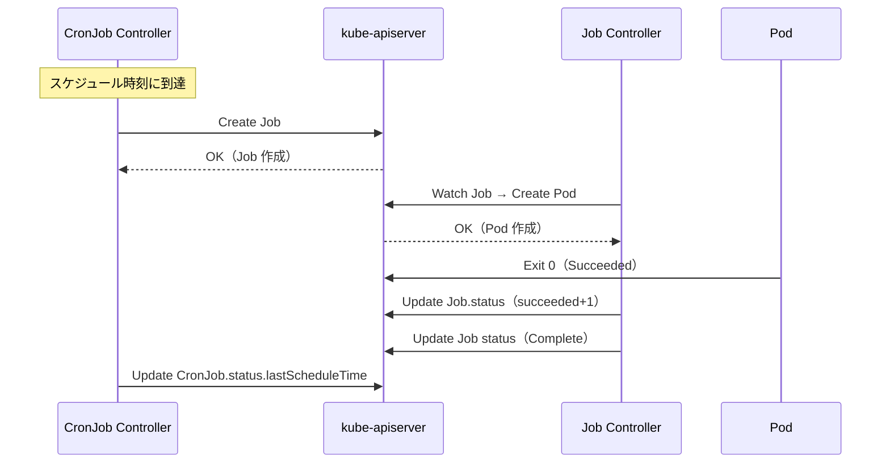

# Job / CronJob

## 1. Job の目的

Job は「バッチ処理の完了保証」を提供する。

Deployment は「Pod を常時稼働させる」のに対し、Job は「指定した回数だけ Pod を**正常完了**させる」ことが目的。

```
Deployment: Pod が死んだら再起動する → 永続的なサービス
Job:        Pod が正常終了したら完了 → 一回限りのバッチ処理
```

典型的なユースケース：
- データベースのマイグレーション
- 機械学習モデルの訓練
- 大量データのバッチ変換
- レポート生成

---

## 2. 型定義（JobSpec）

`staging/src/k8s.io/api/batch/v1/types.go`

```go
type JobSpec struct {
    Parallelism         *int32               // 同時実行 Pod 数の上限
    Completions         *int32               // 正常完了が必要な Pod 数
    ActiveDeadlineSeconds *int64             // Job 全体の最大実行時間
    BackoffLimit        *int32               // 失敗許容回数（デフォルト 6）
    Selector            *metav1.LabelSelector // Pod セレクタ（通常は自動生成）
    Template            v1.PodTemplateSpec   // Pod テンプレート
    CompletionMode      *CompletionMode      // NonIndexed | Indexed
    PodFailurePolicy    *PodFailurePolicy    // 失敗時のアクション定義
    SuccessPolicy       *SuccessPolicy       // 成功判定ポリシー
    BackoffLimitPerIndex *int32              // Indexed Job のインデックス別失敗許容数
    MaxFailedIndexes    *int32               // 失敗を許容するインデックス数の上限
}
```

---

## 3. completions と parallelism

### 基本動作

```
completions=1, parallelism=1（デフォルト）:
  Pod 1 つが正常終了 → Job 完了

completions=10, parallelism=3:
  最大 3 Pod が同時実行
  合計 10 Pod が正常終了したら Job 完了
  ↓
  [Pod-A] [Pod-B] [Pod-C]  ... 3 つ同時実行
  Pod-A 完了 → Pod-D 起動
  [Pod-B] [Pod-C] [Pod-D]  ... また 3 つ
  ...（繰り返し）

completions=nil（未設定）, parallelism=5:
  どれか 1 Pod でも正常終了すれば Job 完了
  残りの Pod はキャンセルされる
```

### 実際の同時実行数

コントローラは常に次の値を維持しようとする：
```
実行すべき Pod 数 = min(parallelism, completions - succeeded)
```

---

## 4. Pod 失敗時の再試行と指数バックオフ

`pkg/controller/job/backoff_utils.go`

Pod が失敗した場合、すぐに再起動せず指数バックオフ待機する。

```
初回失敗後のバックオフ: 10 秒
2 回目の失敗後:         20 秒
3 回目の失敗後:         40 秒
4 回目の失敗後:         80 秒
...
最大:                   10 分（600 秒）
```

実装：

```go
// defaultBackoff = 10s, maxBackoff = 10min
backoffDuration := defaultBackoff
for i := 1; i < int(failuresCount); i++ {
    backoffDuration = backoffDuration * 2
    if backoffDuration >= maxBackoff {
        backoffDuration = maxBackoff
        break
    }
}
```

**成功後のリセット**: Pod が 1 つでも正常終了すると、バックオフカウンタはリセットされる。失敗が成功後に発生した場合のみカウントする設計。

### backoffLimit

`backoffLimit` を超えると Job は `Failed` 状態になり、以降の Pod 作成を停止する。デフォルト値は 6。

---

## 5. Indexed Job（各 Pod に連番インデックスを渡す）

`CompletionMode=Indexed` を設定すると、各 Pod が一意の完了インデックス（0 から completions-1）を受け取る。

```yaml
spec:
  completions: 5
  parallelism: 3
  completionMode: Indexed
```

Pod は以下の方法でインデックスを受け取る：
- 環境変数 `JOB_COMPLETION_INDEX`
- Pod 名に含まれるサフィックス
- アノテーション `batch.kubernetes.io/job-completion-index`

```
Pod job-0: JOB_COMPLETION_INDEX=0 （データ 0-999 を処理）
Pod job-1: JOB_COMPLETION_INDEX=1 （データ 1000-1999 を処理）
Pod job-2: JOB_COMPLETION_INDEX=2 （データ 2000-2999 を処理）
```

このモードでは各インデックスに対して正確に 1 Pod が成功することが必要。失敗した Pod は同じインデックスで再試行される。

**backoffLimitPerIndex**: Indexed Job では、インデックスごとに失敗許容回数を設定できる。ある 1 つのインデックスが失敗し続けても、他のインデックスは処理を続けられる。

---

## 6. PodFailurePolicy（失敗時アクションの細かい制御）

```go
type PodFailurePolicyAction string

const (
    PodFailurePolicyActionFailJob   = "FailJob"   // Job 全体を即座に Failed にする
    PodFailurePolicyActionFailIndex = "FailIndex"  // そのインデックスを Failed にする
    PodFailurePolicyActionIgnore    = "Ignore"     // backoffLimit にカウントしない
    PodFailurePolicyActionCount     = "Count"      // デフォルト（backoffLimit にカウント）
)
```

例：OOM（メモリ不足）は再試行せず即 Failed、一時的なエラーはカウントしない設定:

```yaml
podFailurePolicy:
  rules:
  - action: FailJob
    onExitCodes:
      operator: In
      values: [137]  # OOM Kill
  - action: Ignore
    onPodConditions:
    - type: DisruptionTarget  # ノード障害による中断は無視
```

---

## 7. FinishedCondition と Job の終了判定

```go
const (
    JobComplete           JobConditionType = "Complete"         // 正常完了
    JobFailed             JobConditionType = "Failed"           // 失敗
    JobFailureTarget      JobConditionType = "FailureTarget"    // 失敗確定（終了前）
    JobSuccessCriteriaMet JobConditionType = "SuccessCriteriaMet" // 成功基準達成
)
```

Job Controller の終了チェック:

```
succeeded >= completions  → Complete
failed > backoffLimit     → Failed（BackoffLimitExceeded）
activeDeadlineSeconds 超過 → Failed（DeadlineExceeded）
```

---

## 8. uncountedTerminatedPods（カウント整合性の保証）

Pod の完了を確実に 1 回だけカウントするための仕組み。

```
1. Pod が終了（Succeeded/Failed）
2. Job Controller が Pod UID を status.uncountedTerminatedPods に追加
3. Pod の Finalizer を削除（Pod が実際に削除可能になる）
4. succeeded / failed カウンタを増加
5. status.uncountedTerminatedPods から UID を削除
```

この 3 ステップを atomically に行えないため、中間状態を `uncountedTerminatedPods` で記録して二重カウントを防いでいる。

---

## 9. CronJob の仕組み

CronJob は「スケジュールに従って Job を生成する」コントローラ。

```
CronJob（スケジュール定義）
    │  schedule: "0 */6 * * *"（6 時間ごと）
    │
    ├─ 06:00 → Job-20240101-060000 を作成
    ├─ 12:00 → Job-20240101-120000 を作成
    ├─ 18:00 → Job-20240101-180000 を作成
    └─ 00:00 → Job-20240102-000000 を作成
```

---

## 10. CronJobSpec 型定義

```go
type CronJobSpec struct {
    Schedule                   string           // Cron 形式（例: "0 * * * *"）
    TimeZone                   *string          // タイムゾーン（例: "Asia/Tokyo"）
    StartingDeadlineSeconds    *int64           // スケジュール遅延の許容秒数
    ConcurrencyPolicy          ConcurrencyPolicy // Allow | Forbid | Replace
    Suspend                    *bool            // 一時停止フラグ
    JobTemplate                JobTemplateSpec  // 作成する Job のテンプレート
    SuccessfulJobsHistoryLimit *int32           // 保持する成功 Job 数（デフォルト 3）
    FailedJobsHistoryLimit     *int32           // 保持する失敗 Job 数（デフォルト 1）
}
```

---

## 11. concurrencyPolicy（同時実行制御）

前回の Job がまだ実行中のときに次のスケジュール時刻が来た場合の挙動。

```go
const (
    AllowConcurrent   ConcurrencyPolicy = "Allow"   // 同時実行を許可（デフォルト）
    ForbidConcurrent  ConcurrencyPolicy = "Forbid"  // 実行中なら次をスキップ
    ReplaceConcurrent ConcurrencyPolicy = "Replace" // 実行中を削除して新しいものを起動
)
```

```
Allow:
  Job 1（実行中）
  Job 2（新たに起動）← 同時実行される

Forbid:
  Job 1（実行中）
  スケジュール時刻 → スキップ（Job 1 が終わるまで待つ）

Replace:
  Job 1（実行中） → 削除
  Job 2（新たに起動）← 置き換える
```

実装（`syncCronJob`）:

```go
if cronJob.Spec.ConcurrencyPolicy == batchv1.ForbidConcurrent && len(cronJob.Status.Active) > 0 {
    // スキップして次のスケジュール時刻まで待つ
    t := nextScheduleTimeDuration(cronJob, now, sched)
    return t, updateStatus, nil
}
if cronJob.Spec.ConcurrencyPolicy == batchv1.ReplaceConcurrent {
    for _, j := range cronJob.Status.Active {
        deleteJob(...)  // 実行中の Job を削除
    }
}
```

---

## 12. startingDeadlineSeconds（スケジュール遅延の許容）

CronJob がスケジュール時刻に起動できなかった場合（コントローラ停止、クラスタ障害など）、遅れた起動を許容する時間。

```go
tooLate := false
if cronJob.Spec.StartingDeadlineSeconds != nil {
    tooLate = scheduledTime.Add(
        time.Second * time.Duration(*cronJob.Spec.StartingDeadlineSeconds),
    ).Before(now)
}
if tooLate {
    // Missed scheduling window → スキップ
    return nextScheduleTimeDuration(...), updateStatus, nil
}
```

例：`startingDeadlineSeconds: 300` の場合、スケジュール時刻から 5 分以内に起動できれば OK。5 分を超えたらその実行はスキップ。

---

## 13. CronJob Controller の処理フロー

`pkg/controller/cronjob/cronjob_controllerv2.go`

```
syncCronJob(key)
    │
    ├─ CronJob を Lister から取得
    ├─ 管理対象の Job 一覧を取得（ControllerRef で紐付け）
    │
    ├─ cleanupFinishedJobs()
    │       完了した Job を history limit に従って削除
    │
    └─ syncCronJob(cronJob, jobs)
            │
            ├─ active Job リストを最新化（消えた Job を除外）
            │
            ├─ Suspend チェック → true なら何もしない
            ├─ schedule をパース（cron ライブラリ）
            ├─ nextScheduleTime() → 次の実行時刻を計算
            │
            ├─ scheduledTime > now → requeueAfter を返して再キュー
            ├─ startingDeadlineSeconds チェック → 遅れすぎたらスキップ
            ├─ ConcurrencyPolicy チェック → Forbid/Replace の処理
            │
            └─ CreateJob()  ← Job を API Server に作成
                    Job 名: <cronjob-name>-<timestamp>
                    アノテーション: batch.kubernetes.io/cronjob-scheduled-timestamp
```

---

## 14. Job と CronJob の関係

```
CronJob "daily-backup"
    OwnerReference を持つ Job が複数:
    │
    ├─ daily-backup-1735689600  (2025-01-01T00:00:00)  ← Succeeded
    ├─ daily-backup-1735776000  (2025-01-02T00:00:00)  ← Succeeded
    └─ daily-backup-1735862400  (2025-01-03T00:00:00)  ← Running
                │
                └─ OwnerReference: kind=CronJob, name=daily-backup
```

CronJobStatus:
```go
type CronJobStatus struct {
    Active          []corev1.ObjectReference // 現在実行中の Job のリスト
    LastScheduleTime  *metav1.Time           // 最後にスケジュールされた時刻
    LastSuccessfulTime *metav1.Time          // 最後に成功完了した時刻
}
```

---

## 15. ワークロード選択ガイド

```
継続的に Pod を動かしたい
    ├─ レプリカ数を管理 → Deployment
    ├─ 安定した ID が必要（DB など） → StatefulSet
    └─ 全ノードに 1 Pod → DaemonSet

一時的な処理を実行したい
    ├─ 今すぐ一度だけ → Job
    ├─ 定期的に繰り返す → CronJob
    └─ 大量データを並列処理 → Job（parallelism + Indexed）
```

---

## 16. CronJob → Job → Pod のライフサイクル（Mermaid）



---

## 17. 設計の Why（なぜそう作られているのか）

**Q: なぜ指数バックオフを使うのか？**

同じバグで Pod が繰り返し失敗する場合、即時再起動するとクラスタのリソースを無駄に消費し続け、
他のワークロードに影響するため。
指数バックオフ（10s → 20s → 40s → … → 10min）により、
根本的な問題がある場合でも影響を最小化しながら回復の機会を残せる。

**Q: なぜ `uncountedTerminatedPods` があるのか？**

Pod 完了カウント中に Controller が再起動すると二重カウントが発生するため。
`uncountedTerminatedPods` は「まだ succeeded/failed カウントに反映されていない Pod の UID リスト」を
etcd に記録し、Controller 再起動後も処理を再開できるようにする。これにより冪等性を保証する。

**Q: なぜ `ConcurrencyPolicy` が必要か？**

デフォルトの Allow では長時間バッチが積み重なりリソース枯渇が起きるため、
ユースケースに応じた制御が必要だから。

- **Forbid**: 前のジョブが終わるまで待つ（重複実行を防ぐ）
- **Replace**: 常に最新だけ実行する（古いジョブをキャンセル）

バッチの性質に合った動作を選択できる。

---

## 18. 障害・運用観点

### よくある障害パターン

| 症状 | 根本原因 | 調査コマンド |
|---|---|---|
| `BackoffLimitExceeded` | Pod が `backoffLimit`（デフォルト 6）回失敗 | `kubectl logs job/<name> --previous` でコンテナ終了理由確認 |
| CronJob が Job を作らない | `startingDeadlineSeconds` 超過・`suspend: true` | `kubectl describe cronjob <name>` の Events + `suspend` フィールド確認 |
| Job の Pod が作られない | `activeDeadlineSeconds` 超過で Job が終了済み | `kubectl describe job <name>` で `DeadlineExceeded` 確認 |
| 古い Job が溜まって Pod が起動できない | `successfulJobsHistoryLimit`/`failedJobsHistoryLimit` が大きい | `kubectl get jobs` で蓄積確認、limit 値を下げる |
| CronJob のスケジュールがずれる | コントローラが長時間停止していた（`startingDeadlineSeconds` 超過） | `kubectl describe cronjob <name>` の `lastScheduleTime` 確認 |

### よく使う調査コマンド

```bash
# Job の状態確認
kubectl describe job <job-name>

# Job Pod のログ確認
kubectl logs job/<job-name>
kubectl logs job/<job-name> --previous

# CronJob の状態確認
kubectl describe cronjob <name>

# 実行中の Job 一覧
kubectl get jobs --field-selector=status.active=1

# 失敗した Job の Pod 確認
kubectl get pods --field-selector=status.phase=Failed -l job-name=<name>
```

### 主要 Prometheus メトリクス

| メトリクス名 | 意味 | アラート基準例 |
|---|---|---|
| `kube_job_status_failed` | 失敗した Pod 数（Job ごと） | > 0 でアラート |
| `kube_job_completion_time` | Job の完了時刻（完了した Job のみ） | 想定時間を超えた場合にアラート |
| `kube_cronjob_next_schedule_time` | 次のスケジュール実行予定時刻 | 現在時刻より大幅に過去のままならコントローラが機能していない |
| `kube_job_status_active` | 現在実行中の Pod 数 | 長時間 > parallelism の場合は Pod が終了していない可能性 |

---

## 参照ソース

| ファイル | 内容 |
|---|---|
| `pkg/controller/job/job_controller.go` | Job Controller 定義・sync フロー |
| `pkg/controller/job/backoff_utils.go` | 指数バックオフの実装 |
| `pkg/controller/cronjob/cronjob_controllerv2.go` | CronJob Controller |
| `staging/src/k8s.io/api/batch/v1/types.go` | Job / CronJob 型定義 |
