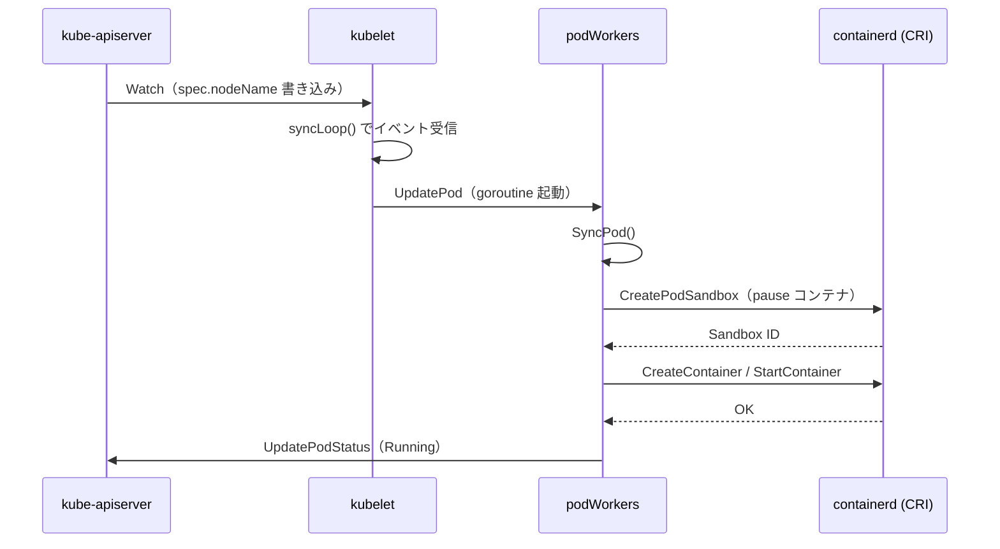

# kubelet の Pod 管理ループ

## 1. kubelet とは何か

kubelet は **各 Node 上で動作するエージェント**。
apiserver から「この Node に Pod を置く」という指示（`spec.nodeName` の書き込み）を受け取り、
実際にコンテナを起動・監視・停止する役割を担う。

```
apiserver
    │
    │ Watch（自分の Node に割り当てられた Pod を監視）
    v
  kubelet（Node 上で動作）
    │
    │ CRI（Container Runtime Interface）
    v
  containerd / CRI-O（コンテナランタイム）
    │
    v
  コンテナ（実際に動いているプロセス）
```

**kubelet の主な責務**:

```
1. Pod のライフサイクル管理  → コンテナの起動・停止・再起動
2. ヘルスチェック（Probe）   → liveness / readiness / startup probe の実行
3. Node ステータス報告       → CPU・メモリ使用量・Node の状態を apiserver に報告
4. ボリューム管理            → Pod が使う PersistentVolume のマウント
5. ガベージコレクション      → 停止済みコンテナ・未使用イメージの削除
```

---

## 2. 全体処理フロー

```
apiserver
    │ Watch: 自 Node に割り当てられた Pod
    v
  syncLoop()  ← kubelet のメインループ（pkg/kubelet/kubelet.go:1944）
    │
    │ Pod の追加・更新・削除イベント
    v
  syncLoopIteration()
    │
    ├── HandlePodAdditions()    ← 新規 Pod
    ├── HandlePodUpdates()      ← 更新 Pod
    └── HandlePodRemoves()      ← 削除 Pod
          │
          v
        podWorkers.UpdatePod()  ← Pod ごとの worker goroutine に委譲
          │
          v
        SyncPod()               ← 1 Pod の同期処理（コンテナ起動等）
```

---

## 3. 主要コンポーネント

### 3-1. syncLoop：メインループ

kubelet の心臓部。`Run()` の末尾で呼ばれ、プロセスが終了するまで動き続ける。

```go
// pkg/kubelet/kubelet.go:1944
kl.syncLoop(ctx, updates, kl)
```

`syncLoop` は複数のイベントソースを `select` で待ち受ける：

```
イベントソース:
  configCh   ← apiserver / staticPod / ファイルからの Pod 設定変更
  plegCh     ← PLEG（Pod Lifecycle Event Generator）からのコンテナ状態変化
  syncCh     ← 定期リシンク（1秒ごと）
  housekeepingCh ← ハウスキーピング処理（2秒ごと）
  livenessManager / readinessManager ← Probe 結果
```

### 3-2. PLEG：コンテナ状態の変化検知

**PLEG（Pod Lifecycle Event Generator）** は、コンテナランタイムを定期的にポーリングして
「コンテナが起動した / 停止した」などの変化を検知し、イベントとして通知するコンポーネント。

```
PLEG の動作:
  1. 1秒ごとにコンテナランタイムに全コンテナの状態を問い合わせる
  2. 前回の状態と比較して変化を検出する
  3. 変化を PodLifecycleEvent として plegCh に送る
  4. syncLoop が受け取って対応する Pod を再同期する
```

**なぜ PLEG が必要か**:
Watch だけでは「コンテナがクラッシュした」などのランタイム側の変化を検知できない。
PLEG がランタイム側の変化を拾い、kubelet に通知する役割を担う。

### 3-3. podWorkers：Pod ごとの worker goroutine

**worker = キューからタスクを取り出して処理する goroutine**。

Pod の追加・更新・削除を受け取ると、podWorkers が **Pod ごとに専用の goroutine** を立て、
その goroutine が `SyncPod()` を呼ぶ。

```
Pod A → goroutine A → SyncPod(Pod A)
Pod B → goroutine B → SyncPod(Pod B)  ← 並行して処理できる
Pod C → goroutine C → SyncPod(Pod C)
```

なぜ Pod ごとに worker を分けるのか：

```
worker が1つの場合:
  Pod A の処理（重い）が終わるまで Pod B・C は待つ
  → 1つの Pod が詰まるとすべてが止まる

Pod ごとに worker を分けた場合:
  Pod A・B・C を並列に処理できる
  → 1つが詰まっても他には影響しない
```

同じ Pod への複数の更新は **直列に処理される**（goroutine は1 Pod に1つだけ）。
これにより「古い更新が新しい更新を上書きする」といった競合を防ぐ。

---

## 4. SyncPod：1 Pod の同期処理

`SyncPod()` は Pod の「あるべき状態」に現状を合わせる処理本体（reconcile）。

```go
// pkg/kubelet/kubelet.go:1996
func (kl *Kubelet) SyncPod(ctx context.Context, updateType kubetypes.SyncPodType,
    pod, mirrorPod *v1.Pod, podStatus *kubecontainer.PodStatus) (isTerminal bool, err error)
```

**SyncPod の処理ステップ**（`pkg/kubelet/kubelet.go:1973` のコメントより）:

```
1. API 用の PodStatus を生成（generateAPIPodStatus）
2. statusManager に現在のステータスを記録
3. Pod が実行可能かチェック（Admission: リソース不足等で拒否することがある）
4. データディレクトリの作成（/var/lib/kubelet/pods/<uid>/）
5. ボリュームのアタッチ・マウント待ち
6. イメージ pull シークレットの取得
7. コンテナランタイムの SyncPod を呼び出す（実際のコンテナ操作）
8. ネットワーク帯域制限の更新
```

各ステップでエラーが発生した場合はそのまま `error` を返し、
podWorkers が再スケジュールして次の呼び出しで再試行する（Reconciliation Loop の特性）。

---

## 5. CRI：コンテナランタイムとの接続

kubelet はコンテナを直接操作せず、**CRI（Container Runtime Interface）** という抽象化レイヤーを通じて
コンテナランタイムに指示を出す。

```
kubelet
    │
    │ gRPC（CRI）
    v
コンテナランタイム
  containerd    ← デフォルト。Docker の代替として普及
  CRI-O         ← Kubernetes 専用の軽量ランタイム
```

**CRI のメリット**:
kubelet のコードがランタイムの実装に依存しない。
containerd を CRI-O に切り替えても kubelet のコードを変更しなくてよい。

**containerd とは**:

コンテナを実際に動かすソフトウェア（コンテナランタイム）。

```
kubelet（「Pod を起動しろ」と管理する係）
    │ CRI（gRPC）
    ▼
containerd（実際にイメージ取得・コンテナ起動・停止をする係）
    │ OCI
    ▼
runc（namespace / cgroups を設定してプロセスを隔離する最小単位）
    │
    ▼
コンテナ（プロセス）
```

Docker との関係：

```
昔:
  kubelet → dockershim → Docker → containerd → runc

今（Kubernetes 1.24 以降）:
  kubelet → containerd → runc
  ↑ Docker を経由しなくなった（dockershim が削除された）
```

Docker は containerd の上に「使いやすい CLI・ネットワーク・ボリューム管理」を乗せたもの。
Kubernetes はそれらが不要なので containerd を直接使う。

イメージの互換性：

```
docker build でビルドしたイメージ
        ↓ OCI 共通規格に従っているため
containerd がそのまま pull して起動できる
```

Docker でビルドしたイメージはそのまま Kubernetes で動く。

**実装**（`pkg/kubelet/kuberuntime/`）:

```
kuberuntime_manager.go  ← kubelet が使うランタイムマネージャ
kuberuntime_sandbox.go  ← Pod サンドボックス（ネットワーク名前空間等）の管理
kuberuntime_container.go ← コンテナの起動・停止
```

**Pod サンドボックスとは**:
同じ Pod 内のコンテナが共有するネットワーク名前空間のこと。
「pause コンテナ」とも呼ばれ、Pod の IP アドレスはこのサンドボックスに割り当てられる。

```
Pod（ネットワーク名前空間を共有）
  ├── pause コンテナ（サンドボックス。IP アドレスを保持）
  ├── コンテナ A（pause のネットワーク名前空間を使う）
  └── コンテナ B（同上）
```

**Pod = 1つ以上のコンテナの集合**:

```
Pod
  ├── pause コンテナ（サンドボックス）← 自動で作られる。ユーザーは意識しない
  ├── app コンテナ（メインのアプリ）
  └── sidecar コンテナ（補助的な処理）← 省略可
```

なぜ複数のコンテナをまとめるのか：

```
「密接に連携する処理は同じ Pod に入れる」という設計思想

例: Web アプリ + ログ収集
  app コンテナ    : アプリが /var/log にログを書く
  sidecar コンテナ: そのログを読んで外部に送る（Fluentd など）

→ ファイルシステム（Volume）を共有しているので直接ファイルを渡せる
→ ネットワークも共有（localhost で通信できる）
```

同じ Pod 内のコンテナが共有するもの：

```
共有する:
  ネットワーク namespace（同じ IP、localhost で通信可）
  Volume（マウントした場合）

共有しない:
  プロセス空間（デフォルト）
  ファイルシステム（Volume でマウントしない限り）
```

**pause コンテナの役割**:

```
Pod 起動時、最初に pause コンテナが起動する
  ↓
pause コンテナが「ネットワーク namespace」を確保・保持する
  ↓
他のコンテナはその namespace に参加する形で起動する
  ↓
app コンテナがクラッシュして再起動しても
namespace（= IP アドレス）は pause コンテナが保持し続ける
→ Pod の IP が変わらない
```

pause コンテナは何もしない（文字通り pause しているだけ）。
IP アドレスの「器」として存在している。

---

## 6. Probe：ヘルスチェック

kubelet は Pod の各コンテナに対してヘルスチェック（Probe）を定期的に実行する。

```
実装: pkg/kubelet/prober/
  prober_manager.go  ← Probe の管理・goroutine の起動
  worker.go          ← 各コンテナの Probe を実行する goroutine
  prober.go          ← 実際の Probe 実行（HTTP/TCP/Exec）
```

**3種類の Probe**:

```
liveness probe（生存確認）:
  失敗するとコンテナを再起動する
  → デッドロックや応答不能になったコンテナを自動回復

readiness probe（準備確認）:
  失敗すると Pod を Service のエンドポイントから外す
  → 起動中・処理中で外部トラフィックを受け付けられない間だけ外す
  → コンテナは再起動されない

startup probe（起動確認）:
  起動完了を確認するまで liveness/readiness probe の実行を保留する
  → 起動に時間がかかるアプリで liveness が誤って失敗するのを防ぐ
```

**Probe の実行方法**:

```
HTTP GET   → 指定したエンドポイントに HTTP リクエストを送る（2xx/3xx = 成功）
TCP Socket → 指定したポートへの TCP 接続を試みる（接続成功 = 成功）
Exec       → コンテナ内でコマンドを実行する（exit code 0 = 成功）
gRPC       → gRPC ヘルスチェックプロトコルを使う
```

**実装の仕組み**:
コンテナごとに専用の worker goroutine が起動し、独立して Probe を実行する。
結果は `ResultManager` に格納され、syncLoop が参照して Pod の再同期をトリガーする。

---

## 7. Node ステータス報告

kubelet は定期的に自 Node の状態を apiserver に報告する。

```go
// pkg/kubelet/kubelet.go:1902
wait.JitterUntil(func() { kl.syncNodeStatus(ctx) },
    kl.nodeStatusUpdateFrequency, 0.04, true, wait.NeverStop)
```

**報告する情報**:

```
Node.status.conditions:
  Ready          → kubelet が正常に動作しており Pod を受け付けられるか
  MemoryPressure → メモリが逼迫しているか
  DiskPressure   → ディスクが逼迫しているか
  PIDPressure    → プロセス数が上限に近いか

Node.status.capacity / allocatable:
  CPU・メモリ・ストレージ・最大 Pod 数の上限と使用可能量

Node.status.addresses:
  Node の IP アドレス・ホスト名
```

**Node Lease**:
ステータス全体を毎回送ると apiserver の負荷が高くなるため、
「kubelet が生きている」というハートビートは `Lease` オブジェクト（軽量）で定期送信する。
Node が応答しなくなると Lease が更新されなくなり、Node が NotReady と判定される。

---

## 8. ガベージコレクション

kubelet は停止済みコンテナや不要なイメージを定期的に削除する。

```go
// pkg/kubelet/kubelet.go:1672
go wait.Until(func() {
    if err := kl.containerGC.GarbageCollect(ctx); err != nil { ... }
}, ContainerGCPeriod, wait.NeverStop)
```

```
コンテナ GC: 停止済みコンテナを削除（デフォルト 1 分ごと）
イメージ GC:  ディスク使用率が閾値を超えたら古いイメージを削除（デフォルト 5 分ごと）
```

---

## 9. よくある疑問 Q&A

**Q: kubelet は何を Watch しているのか？**

自 Node に割り当てられた Pod だけを Watch する（`spec.nodeName == <自分の Node 名>`）。
全 Pod を Watch すると apiserver の負荷が大きいため、フィールドセレクタで絞る。

**Q: Static Pod とは何か？なぜ必要か？**

apiserver を通さず、ファイルシステム上の YAML ファイルから直接 kubelet が管理する Pod。
`/etc/kubernetes/manifests/` に置くと自動で起動される。
etcd・apiserver・controller-manager・scheduler 自体がこの仕組みで動いている（self-hosted）。

**なぜ必要か** → Control Plane コンポーネント自体を起動するための「鶏と卵」問題を解決するため。

```
通常の Pod の起動フロー:
  kubectl apply → apiserver → etcd → Scheduler → kubelet → コンテナ起動

問題:
  apiserver を起動するには kubelet が必要
  通常の Pod を動かすには apiserver が必要
  → apiserver 自体を通常の Pod として起動できない（デッドロック）

解決策 = Static Pod:
  kubelet だけ OS の systemd で起動（apiserver 不要）
       ↓
  kubelet が /etc/kubernetes/manifests/ を読む
       ↓
  apiserver・etcd・scheduler を Static Pod として直接起動
       ↓
  クラスター全体が動き出す
```

実際の Control Plane Node のファイル構成：

```
/etc/kubernetes/manifests/
  etcd.yaml                    ← etcd の Static Pod 定義
  kube-apiserver.yaml          ← apiserver の Static Pod 定義
  kube-controller-manager.yaml ← controller-manager の Static Pod 定義
  kube-scheduler.yaml          ← scheduler の Static Pod 定義
```

kubelet がこのディレクトリを監視し、ファイルが追加・変更されると自動で起動・再起動する。

**Q: コンテナが crash loop に入ったらどうなるか？**

liveness probe が失敗するか、コンテナが exit code 非ゼロで終了すると kubelet が再起動する。
`RestartPolicy` に従い、再起動間隔は指数バックオフで増加する（最大 5 分）。
この状態が `CrashLoopBackOff` として表示される。

**なぜ指数バックオフが必要か**:

即座に再起動し続けると、壊れたコンテナが CPU・メモリを無駄に消費し続けるから。

```
指数バックオフなし（即座に再起動）:
  起動 → クラッシュ → 即再起動 → クラッシュ → 即再起動 ...
  → CPU を無駄消費・ログが大量発生・他の Pod にも影響

指数バックオフあり:
  クラッシュ → 10秒待つ → 再起動 → クラッシュ
  → 20秒待つ → 再起動 → クラッシュ
  → 40秒待つ → ...（最大 5分）
  → リソース消費を抑えつつ、回復の機会を残す
```

「指数」の意味（待機時間が2倍ずつ増える）:

```
等差（10秒ずつ増加）: 10, 20, 30, 40 ... → 300秒まで 29回かかる
指数（2倍ずつ増加）: 10, 20, 40, 80, 160, 300 → 6回で上限に達する
                                                   ↑ 短時間で大きな待機時間になる
```

すぐ直せる問題（設定ミスなど）は早期の再起動で回復でき、
直せない問題（バグなど）は待機時間が伸びて影響を最小化できる、という両立が理由。

**Q: 「Node が NotReady」になる条件は？**

kubelet が Node Lease を更新しなくなってから一定時間（デフォルト 40 秒）経過すると
`node-lifecycle-controller` が Node を NotReady に変更し、Pod の Eviction を開始する。

**Eviction とは**:

Pod を強制的に追い出すこと。2種類ある。

**① Node リソース不足による Eviction（kubelet が実行）**:

```
Node のメモリが逼迫してきた
       ↓
kubelet が「このままだと Node ごとクラッシュする」と判断
       ↓
優先度の低い Pod を選んで強制削除
       ↓
その Pod は別の Node で再スケジュールされる

閾値の例:
  利用可能メモリ < 100Mi → Eviction 開始
  ディスク残量   < 10%   → Eviction 開始
```

**② Node 障害による Eviction（NodeLifecycle Controller が実行）**:

```
Node が NotReady になった
       ↓
NodeLifecycle Controller が NoExecute Taint を付与
       ↓
Toleration のない Pod を削除（Eviction）
       ↓
別の Node で再スケジュールされる
```

通常の削除との違い：

```
kubectl delete pod → ユーザーの意図的な操作
Eviction          → Kubernetes が自動で行う強制削除

どちらも ReplicaSet が検知して新しい Pod を作る（結果はほぼ同じ、起点が違う）
```

`PodDisruptionBudget`（PDB）を設定すると「同時に Eviction できる Pod 数の上限」を制限できる。
ローリングアップデートや Node メンテナンス時に、サービス全断を防ぐために使う。

---

## 10. Pod 起動シーケンス（Mermaid）



---

## 11. 設計の Why（なぜそう作られているのか）

**Q: なぜ CRI（抽象層）を挟むのか？**

コンテナランタイムの差し替え可能性を保つため。
Docker 削除 → containerd 移行が kubelet のコード変更なしで実現できた実績がその証拠。
CRI という gRPC インターフェースを挟むことで、kubelet はランタイムの実装詳細を知らなくてよい。

**Q: なぜ Pod ごとに worker goroutine を持つのか？**

1 Pod の処理遅延が他の Pod を止めない隔離性を確保するため。
単一 goroutine で全 Pod を処理すると、重い Pod が完了するまで他の Pod の起動・停止が待たされる。
Pod ごとに独立した goroutine を立てることで並列処理を実現し、障害の影響範囲を Pod 単位に閉じ込められる。

**Q: なぜ PLEG（Pod Lifecycle Event Generator）を使うのか？**

コンテナランタイムへのポーリングを 1 goroutine に集約し、CPU 使用量を最小化するため。
Watch だけではランタイム側のコンテナクラッシュを検知できない。
PLEG は全コンテナを一括監視し、変化があったときだけ syncLoop に通知する設計により、
コンテナ数が増えても監視の CPU コストを O(1) に保つ。

---

## 12. 障害・運用観点

### よくある障害パターン

| 症状 | 根本原因 | 調査コマンド |
|---|---|---|
| `CrashLoopBackOff` | コンテナが繰り返しクラッシュ（バグ・設定ミス・OOM） | `kubectl logs <pod> --previous` で exit code 確認 |
| `ImagePullBackOff` | レジストリ認証失敗・ネットワーク疎通不可・イメージ名誤り | `kubectl describe pod <pod>` の Events 確認 |
| `OOMKilled` | コンテナのメモリ使用量が limits を超過 | `kubectl top pod <pod>` + `container_memory_working_set_bytes` 確認 |
| `Init:CrashLoopBackOff` | initContainer が繰り返し失敗 | `kubectl logs <pod> -c <init-container>` |
| `ContainerCreating` が長時間 | PVC マウント待ち・イメージ pull 遅延・CRI エラー | `kubectl describe pod <pod>` の Events 確認 |
| Node が NotReady | kubelet プロセス停止・ネットワーク断・リソース枯渇 | `journalctl -u kubelet -n 100` で kubelet ログ確認 |

### よく使う調査コマンド

```bash
# Pod の詳細イベント確認
kubectl describe pod <pod-name> -n <namespace>

# 直前のクラッシュログ確認
kubectl logs <pod-name> --previous -n <namespace>

# Node 上の kubelet ログ確認（systemd 環境）
journalctl -u kubelet -f

# Node の状態確認
kubectl describe node <node-name>

# Pod のリソース使用量確認
kubectl top pod <pod-name> -n <namespace>
```

### 主要 Prometheus メトリクス

| メトリクス名 | 意味 | アラート基準例 |
|---|---|---|
| `kubelet_running_pods` | kubelet が管理している実行中 Pod 数 | 急激な減少でアラート |
| `kubelet_pod_start_duration_seconds_bucket` | Pod 起動レイテンシ（CRI 呼び出しから Running まで） | p99 > 60s でアラート |
| `container_oom_events_total` | OOM Kill が発生したコンテナ数の累計 | 増加トレンドでアラート |
| `container_memory_working_set_bytes` | コンテナのメモリ実使用量（limits との比較用） | limits の 80% 超でアラート |
| `kubelet_pleg_relist_duration_seconds_bucket` | PLEG がコンテナランタイムに問い合わせる時間 | p99 > 10s でアラート（PLEG unhealthy の予兆） |

---

## 13. 次に読むべきファイル

### kubelet のメインループ

```
pkg/kubelet/kubelet.go:1828
  └── Run() - 各サブシステムの起動・syncLoop の呼び出し

pkg/kubelet/kubelet.go:1944
  └── syncLoop() - メインイベントループ（select で複数ソースを待ち受け）

pkg/kubelet/kubelet.go:1996
  └── SyncPod() - 1 Pod の同期処理（コメントにワークフロー全体が記述されている）
```

### Pod worker と状態管理

```
pkg/kubelet/pod_workers.go:264
  └── podSyncer インターフェース - SyncPod/SyncTerminatingPod/SyncTerminatedPod の定義
      Pod のライフサイクルステートマシンを理解する起点
```

### CRI（コンテナランタイム連携）

```
pkg/kubelet/kuberuntime/kuberuntime_manager.go
  └── kubeGenericRuntimeManager - CRI 経由のコンテナ操作の中核

pkg/kubelet/kuberuntime/kuberuntime_container.go
  └── startContainer() - コンテナ起動の実装

pkg/kubelet/kuberuntime/kuberuntime_sandbox.go
  └── createPodSandbox() - Pod サンドボックス（pause コンテナ）の作成
```

### Probe（ヘルスチェック）

```
pkg/kubelet/prober/prober_manager.go
  └── manager - Probe goroutine の管理

pkg/kubelet/prober/worker.go
  └── worker.run() - 各コンテナの Probe 実行ループ
```

### Node ステータス

```
pkg/kubelet/kubelet_node_status.go
  └── syncNodeStatus() - Node ステータスを apiserver に報告する処理
```
