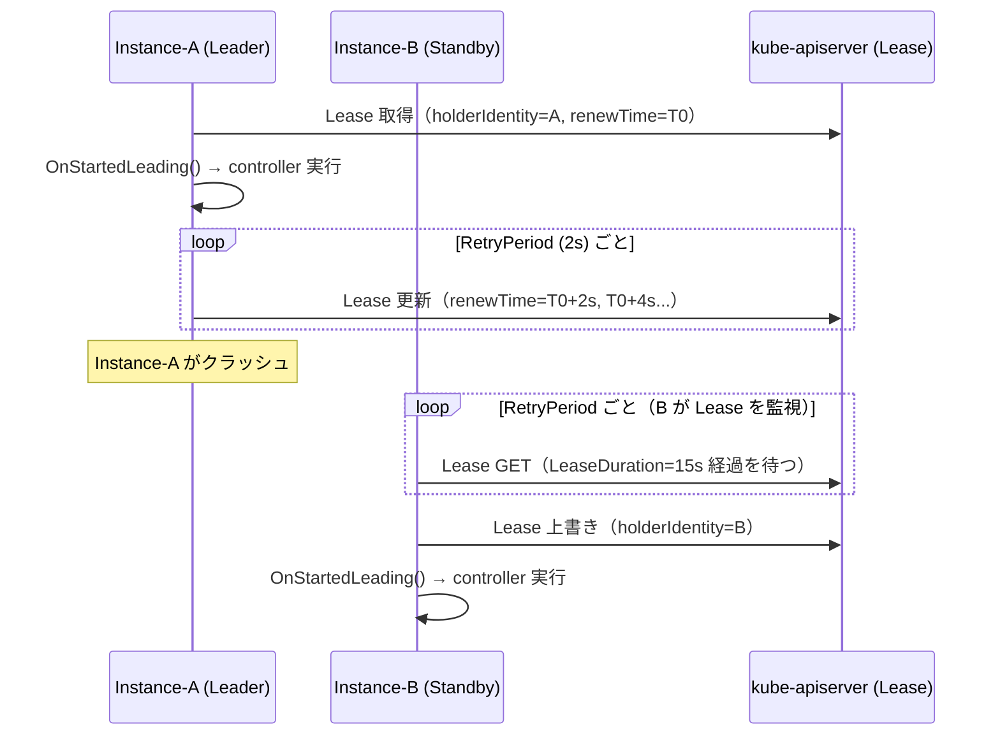

# Leader Election（リーダーエレクション）

## 1. なぜ Leader Election が必要か

kube-controller-manager や kube-scheduler は複数インスタンスで冗長化できるが、
同じリソースを複数のインスタンスが同時に制御すると競合が発生する。

Leader Election は「1 つのインスタンスだけがアクティブに動作する」ことを保証する仕組みだ。

```
kube-controller-manager × 3 インスタンス

  Instance-A: Leader（アクティブ）→ controller を実行
  Instance-B: Standby（待機）→ Lease を監視
  Instance-C: Standby（待機）→ Lease を監視

Instance-A が停止 → Instance-B または Instance-C が Leader を取得
```

---

## 2. Lease リソース

Leader Election は Kubernetes の **Lease** オブジェクトを使う。

```yaml
apiVersion: coordination.k8s.io/v1
kind: Lease
metadata:
  name: kube-controller-manager
  namespace: kube-system
spec:
  holderIdentity: "node1_uuid"        # 現在の Leader
  leaseDurationSeconds: 15            # Lease の有効期間
  acquireTime: "2024-01-01T00:00:00Z" # 取得時刻
  renewTime: "2024-01-01T00:01:30Z"   # 最後に更新した時刻
  leaseTransitions: 3                 # Leader が切り替わった回数
```

### 旧実装との違い

| 実装 | ストレージ | 問題点 |
|---|---|---|
| 旧: Endpoints アノテーション | Endpoints オブジェクトのアノテーション | Endpoints の本来の用途と混在 |
| 旧: ConfigMap アノテーション | ConfigMap のアノテーション | 本来の用途と混在 |
| 現: Lease オブジェクト | coordination.k8s.io/v1 Lease | 専用リソース・軽量・高頻度更新に最適化 |

---

## 3. 実装の型定義

`staging/src/k8s.io/client-go/tools/leaderelection/leaderelection.go`

```go
type LeaderElectionConfig struct {
    // Lock は競合に使うリソース（Lease オブジェクト）
    Lock rl.Interface

    // LeaseDuration: 非リーダーがこの時間 Lease の更新を確認できなければ
    // 強制的に Lease を取得しようとする（デフォルト 15 秒）
    LeaseDuration time.Duration

    // RenewDeadline: 現リーダーがこの時間内に Lease を更新できなければ
    // リーダーを放棄する（デフォルト 10 秒）
    RenewDeadline time.Duration

    // RetryPeriod: 非リーダーが Lease 取得を試みる間隔（デフォルト 2 秒）
    RetryPeriod time.Duration

    // Callbacks: リーダー状態変化時のコールバック
    Callbacks LeaderCallbacks
}

type LeaderCallbacks struct {
    OnStartedLeading func(context.Context)  // リーダーになった時
    OnStoppedLeading func()                 // リーダーでなくなった時
    OnNewLeader      func(identity string)  // 別のリーダーを観測した時
}
```

---

## 4. Leader Election のフロー

### acquire（Lease 取得）

```go
func (le *LeaderElector) acquire(ctx context.Context) bool {
    // RetryPeriod × JitterFactor(1.2) の間隔で繰り返す
    wait.JitterUntilWithContext(ctx, func(ctx context.Context) {
        succeeded = le.tryAcquireOrRenew(ctx)
        // 成功したら cancel してループを抜ける
        if succeeded {
            cancel()
        }
    }, le.config.RetryPeriod, JitterFactor, true)
    return succeeded
}
```

### tryAcquireOrRenew（Lease の取得または更新）

```
1. Lease オブジェクトを GET
   ├─ 存在しない → Create して自分が Leader になる
   └─ 存在する
        ├─ holderIdentity == 自分 → 更新時刻を Update して Lease を延長
        └─ holderIdentity == 他者
             ├─ renewTime から LeaseDuration 経過していない → 諦める（Leader が生きている）
             └─ LeaseDuration 経過 → Lease を上書きして Leader を取得
```

### renew（Lease の定期更新）

```go
func (le *LeaderElector) renew(ctx context.Context) {
    // RetryPeriod 間隔で RenewDeadline 時間内に更新を試みる
    wait.PollUntilContextTimeout(ctx,
        le.config.RetryPeriod,
        le.config.RenewDeadline, ...)
    // RenewDeadline 内に更新できなければリーダー権を放棄
}
```

---

## 5. Run の全体フロー

```go
func (le *LeaderElector) Run(ctx context.Context) {
    defer le.config.Callbacks.OnStoppedLeading()  // 必ず呼ばれる

    if !le.acquire(ctx) {
        return  // ctx がキャンセルされた
    }

    // リーダーになった
    go le.config.Callbacks.OnStartedLeading(ctx)  // controller 実行開始
    le.renew(ctx)  // Lease の更新ループ（ここでブロック）
    // renew が終わる = リーダー権を失った → OnStoppedLeading が defer で呼ばれる
}
```

---

## 6. タイムライン図（正常系・フェイルオーバー）



---

## 7. kube-controller-manager での使い方

`cmd/kube-controller-manager/app/controllermanager.go`

```go
// リーダーエレクション設定
leaderElectionConfig := leaderelection.LeaderElectionConfig{
    Lock: &resourcelock.LeaseLock{
        LeaseMeta: metav1.ObjectMeta{
            Name:      "kube-controller-manager",
            Namespace: "kube-system",
        },
    },
    LeaseDuration: c.ComponentConfig.Generic.LeaderElection.LeaseDuration.Duration,
    RenewDeadline: c.ComponentConfig.Generic.LeaderElection.RenewDeadline.Duration,
    RetryPeriod:   c.ComponentConfig.Generic.LeaderElection.RetryPeriod.Duration,
    Callbacks: leaderelection.LeaderCallbacks{
        OnStartedLeading: func(ctx context.Context) {
            // コントローラを起動
            run(ctx, controllerContext)
        },
        OnStoppedLeading: func() {
            // プロセスを終了（Standby に戻らない）
            klog.Fatal("leaderelection lost")
        },
    },
}
leaderelection.RunOrDie(ctx, leaderElectionConfig)
```

---

## 8. デフォルト値とその意味

| パラメータ | デフォルト | 意味 |
|---|---|---|
| `LeaseDuration` | 15s | この時間 Lease 更新が止まれば、他が Leader を奪える |
| `RenewDeadline` | 10s | Leader がこの時間内に更新できなければ自主的に放棄 |
| `RetryPeriod` | 2s | 非 Leader が次に試みるまでの間隔 |

```
最悪のフェイルオーバー時間:
  LeaseDuration(15s) + RetryPeriod(2s) × JitterFactor(1.2) ≒ 約 17.4 秒

  （Leader がクラッシュ → Standby が LeaseDuration 経過を確認 → Lease 取得）
```

---

## 9. 設計の Why（なぜそう作られているのか）

**Q: なぜ分散ロックではなく Lease オブジェクトを使うのか？**

etcd の分散ロック（etcd lease/mutex）を使う設計も可能だが、
Kubernetes が既に etcd 上の apiserver 経由で全オブジェクトを管理しているため、
Lease を通常の Kubernetes リソースとして扱える。

認証・認可・監査ログが自動適用され、`kubectl get lease -n kube-system` で状態が確認できる。
また etcd への直接接続を増やさず、apiserver 経由に統一できる。

---

**Q: なぜ `OnStoppedLeading` でプロセスを kill するのか？**

Leader 権を失ったコントローラが動き続けると、新しい Leader と同じリソースを二重に操作する危険がある。

プロセスを終了させることで確実に Active インスタンスが 1 つになる。

Kubernetes は Pod の再起動（Deployment/DaemonSet）で自動的に Standby に戻すため、
kill → 再起動のサイクルが安全なフェイルオーバー手順になっている。

---

**Q: なぜ JitterFactor（ランダムな揺らぎ）を入れるのか？**

複数の Standby が同時に Lease 取得を試みると、全員が同じタイミングで API を叩き「選挙の嵐」が起きる。

RetryPeriod に JitterFactor=1.2 の乱数を掛けることで試行タイミングをずらし、
1 つのインスタンスが先に Lease を取得できるようにする。

---

## 10. 障害・運用観点

### よくある障害パターン

| 症状 | 根本原因 | 調査コマンド |
|---|---|---|
| フェイルオーバーに 15 秒以上かかる | LeaseDuration が大きい（デフォルト値を変えていない） | `kubectl get lease kube-controller-manager -n kube-system -o yaml` でパラメータ確認 |
| リーダーが頻繁に切り替わる | kube-apiserver のレイテンシが高く Lease 更新が RenewDeadline を超えている | `apiserver_request_duration_seconds` の p99 確認 |
| controller-manager が全員 Standby になる | etcd へのアクセス障害（ネットワーク分断・etcd 停止） | `kubectl get lease -n kube-system` → Leader が空になる |
| `leaderelection lost` でプロセスが再起動を繰り返す | Lease 更新が不安定（apiserver 過負荷・ネットワーク揺れ） | `kubectl describe pod kube-controller-manager-<node>` でリスタート回数確認 |

### よく使う調査コマンド

```bash
# 現在の Leader を確認
kubectl get lease kube-controller-manager -n kube-system -o yaml

kubectl get lease kube-scheduler -n kube-system -o yaml

# Leader 変化の履歴（Kubernetes イベント）
kubectl get events -n kube-system --field-selector reason=LeaderElection

# Lease の更新が止まっているか確認（renewTime を監視）
kubectl get lease kube-controller-manager -n kube-system -w
```

### 主要 Prometheus メトリクス

| メトリクス名 | 意味 | アラート基準例 |
|---|---|---|
| `leader_election_master_status` | 自身が Leader かどうか（1=Leader, 0=Follower） | 全インスタンスが 0 ならアラート |
| `workqueue_depth{name="..."}` | 各コントローラのキュー深さ | 増加し続けるなら controller が動いていない |
| `rest_client_requests_total` | apiserver への API リクエスト数 | Leader 切り替え時に急増 |

---

## 参照ソース

| ファイル | 内容 |
|---|---|
| `staging/src/k8s.io/client-go/tools/leaderelection/leaderelection.go` | LeaderElector 実装・acquire・renew |
| `staging/src/k8s.io/client-go/tools/leaderelection/resourcelock/leaselock.go` | Lease ロック実装 |
| `staging/src/k8s.io/client-go/tools/leaderelection/resourcelock/interface.go` | ロックインターフェース定義 |
| `cmd/kube-controller-manager/app/controllermanager.go` | controller-manager での使用例 |
