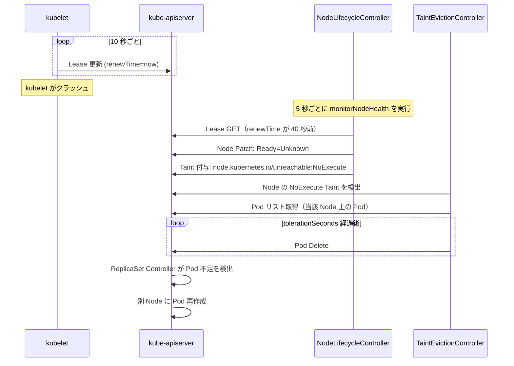

# Node Lifecycle と Eviction（ノードライフサイクルと退避）

## 1. Node Lifecycle の全体像

NodeLifecycleController は「ノードが生きているか」を監視し、異常なノードに Taint を付けて Pod を退避させる。

```
kubelet（各ノード）
  │  heartbeat（NodeStatus / Lease 更新）
  ▼
kube-apiserver
  │
  ▼
NodeLifecycleController（kube-controller-manager の中）
  ├─ ノードの健全性チェック（monitorNodeHealth）
  ├─ NotReady/Unreachable Taint の付与
  └─ TaintEviction Controller（Taint に基づく Pod 退避）
```

---

## 2. Heartbeat の仕組み

kubelet は 2 つの方法でノードの生存を報告する。

### 方法 1: NodeStatus（重い）

NodeStatus に CPU・メモリ・Image リストなどフルの情報を含む。
デフォルト 5 分ごとに更新（`--node-status-update-frequency`、旧来の方式）。

### 方法 2: Lease（軽い）

`coordination.k8s.io/v1` の Lease オブジェクトのみを更新。
デフォルト 10 秒ごとに更新（`--node-lease-duration-seconds`）。

```
/api/v1/namespaces/kube-node-lease/leases/<node-name>

renewTime: 2024-01-01T00:00:10Z  ← kubelet が更新
```

**設計の理由**: NodeStatus 更新は etcd への大きな書き込みを伴い、ノード数が増えると apiserver と etcd に大きな負荷がかかる。Lease はごく小さいオブジェクトで、高頻度更新のコストが低い。

---

## 3. NodeLifecycleController の構造

`pkg/controller/nodelifecycle/node_lifecycle_controller.go`

```go
type Controller struct {
    taintManager    *tainteviction.Controller  // Taint → Pod 退避の実行

    nodeHealthMap   *nodeHealthMap              // Node ごとの最終確認時刻を記録
    zoneStates      map[string]ZoneState        // ゾーンの状態（Normal/PartialDisruption/FullDisruption）
    zoneNoExecuteTainter map[string]*scheduler.RateLimitedTimedQueue  // Taint 付与のレートリミット

    nodeMonitorGracePeriod  time.Duration  // Heartbeat がない場合の猶予期間（デフォルト 40s）
    nodeStartupGracePeriod  time.Duration  // 新規ノードへの猶予期間（デフォルト 60s）
    nodeMonitorPeriod       time.Duration  // 監視ループの間隔（デフォルト 5s）
}
```

### ノードの状態遷移

```
kubelet が正常に動作
  │ Lease を 10 秒ごとに更新
  ▼
NodeLifecycleController が 5 秒ごとに確認

  最後の更新から 40 秒（nodeMonitorGracePeriod）経過
  │
  ▼
node.status.conditions.Ready → Unknown（Unreachable と判断）
  │
  ├─ Taint: node.kubernetes.io/unreachable:NoExecute を付与
  └─ さらに Pod 退避タイマーを起動
       │（デフォルト 300 秒後）
       ▼
       Pod を Node から退避（Delete）
```

---

## 4. 条件と Taint のマッピング

```go
// node_lifecycle_controller.go
nodeConditionToTaintKeyStatusMap = map[v1.NodeConditionType]map[v1.ConditionStatus]string{
    v1.NodeReady: {
        v1.ConditionFalse:   v1.TaintNodeNotReady,        // node.kubernetes.io/not-ready
        v1.ConditionUnknown: v1.TaintNodeUnreachable,     // node.kubernetes.io/unreachable
    },
    v1.NodeMemoryPressure: {
        v1.ConditionTrue: v1.TaintNodeMemoryPressure,     // node.kubernetes.io/memory-pressure
    },
    v1.NodeDiskPressure: {
        v1.ConditionTrue: v1.TaintNodeDiskPressure,       // node.kubernetes.io/disk-pressure
    },
    v1.NodeNetworkUnavailable: {
        v1.ConditionTrue: v1.TaintNodeNetworkUnavailable, // node.kubernetes.io/network-unavailable
    },
    v1.NodePIDPressure: {
        v1.ConditionTrue: v1.TaintNodePIDPressure,        // node.kubernetes.io/pid-pressure
    },
}
```

各 Taint の `Effect`:

| Taint | Effect | 意味 |
|---|---|---|
| `node.kubernetes.io/not-ready` | NoExecute | Pod を退避させる |
| `node.kubernetes.io/unreachable` | NoExecute | Pod を退避させる |
| `node.kubernetes.io/memory-pressure` | NoSchedule | 新規 Pod を配置しない |
| `node.kubernetes.io/disk-pressure` | NoSchedule | 新規 Pod を配置しない |
| `node.kubernetes.io/unschedulable` | NoSchedule | kubectl cordon 時に付与 |

---

## 5. Rate-Limiter とゾーン（Zone）ベースの退避制御

ネットワーク障害などで大量のノードが同時に Unknown になった場合、全 Pod を一斉退避させるとクラスタが壊滅する。

NodeLifecycleController はゾーン単位の**障害率**を計算し、退避レートを動的に調整する。

```
ZoneState の種別:

stateNormal          ← 大部分のノードが Ready（通常の速度で退避）
statePartialDisruption ← 障害率 > unhealthyZoneThreshold（退避レートを下げる）
stateFullDisruption   ← 全ノードが Unknown（退避を停止）
```

```go
const (
    stateNormal           = ZoneState("Normal")
    statePartialDisruption = ZoneState("PartialDisruption")
    stateFullDisruption    = ZoneState("FullDisruption")
)
```

### なぜゾーン概念があるのか

AWS/GCP の Availability Zone に対応。

同じゾーンのノードが全滅した場合、それはゾーン全体のネットワーク障害の可能性が高い。
この場合 Pod を退避させても他のノードに移動できないので、退避を止めて復旧を待つ方が合理的。

---

## 6. Pod 退避のフロー（Taint-Based Eviction）

```
Node に NoExecute Taint が付与される
  │
  ▼
Pod の tolerationSeconds を確認
  ├─ Toleration なし → 即座に退避
  ├─ tolerationSeconds=300 → 300 秒後に退避
  └─ tolerationSeconds=0 → 即座に退避（0 は即座）

TaintEviction Controller が対象 Pod を Delete
  │
  ▼
Pod の ownerReference（ReplicaSet/StatefulSet など）が検知
  │
  ▼
別のノードで Pod を再作成
```

### DaemonSet Pod は退避されない

DaemonSet の Pod には `node.kubernetes.io/not-ready:NoExecute` と `node.kubernetes.io/unreachable:NoExecute` への Toleration が自動付与される。
ノードが異常でも DaemonSet Pod は残り続けることで、復旧後にすぐ機能できる。

---

## 7. Node Conditions

kubelet が更新する NodeCondition と、NodeLifecycleController が設定するもの：

| Condition | 設定者 | 意味 |
|---|---|---|
| `Ready` | kubelet | ノードが Pod を受け入れられる状態か |
| `MemoryPressure` | kubelet | メモリが不足しているか |
| `DiskPressure` | kubelet | ディスクが不足しているか |
| `PIDPressure` | kubelet | PID が不足しているか |
| `NetworkUnavailable` | CNI プラグイン | ネットワークが設定されているか |

`Ready=Unknown` は NodeLifecycleController が kubelet からの heartbeat タイムアウトを検出して設定する。

---

## 8. Node Lifecycle の全フロー（Mermaid）



---

## 9. Eviction と PodDisruptionBudget（PDB）

**重要**: NodeLifecycleController による退避（Taint-Based Eviction）は **PDB を考慮しない**。

PDB を考慮した退避は `kubectl drain`（Eviction API）を使った場合のみ。

| 退避の種類 | PDB を考慮するか |
|---|---|
| Taint-Based Eviction（NodeLifecycleController） | しない |
| `kubectl drain`（Eviction API） | する |
| `kubectl delete pod`（直接削除） | しない |

### PDB とは

Pod が同時に停止できる数を制限する設定。

```yaml
apiVersion: policy/v1
kind: PodDisruptionBudget
metadata:
  name: web-pdb
spec:
  minAvailable: 2         # 常に最低 2 Pod は稼働を保証
  selector:
    matchLabels:
      app: web
```

`kubectl drain` で PDB に違反する場合、drain が止まりエラーを返す。

---

## 10. 設計の Why（なぜそう作られているのか）

**Q: なぜ NodeStatus ではなく Lease で heartbeat するのか？**

NodeStatus は CPU・メモリ・Image リストを含む大きなオブジェクトで、1 ノードあたり数KB〜数十KB になる。

1000 ノードのクラスタで 10 秒ごとに全員が NodeStatus を更新すると、apiserver と etcd に毎秒 100 リクエストの大きな書き込みが発生する。

Lease は数百バイトと非常に小さく、高頻度更新のコストを大幅に削減できる。

---

**Q: なぜ FullDisruption 時に退避を停止するのか？**

全ノードが同時に Unknown になるのはネットワーク分断の典型パターンだ。

この状態で全 Pod を退避させると、どのノードにも移動できず Pod が Pending のままになるだけでなく、etcd への大量の Delete/Create が集中してクラスタが不安定になる。

退避を止めてネットワーク復旧を待つことで、復旧後に Pod がその場で再稼働できる。

---

**Q: なぜ Taint-Based Eviction は PDB を考慮しないのか？**

ノード障害は緊急事態であり、PDB の制約に従って退避を遅らせるよりも、素早くフェイルオーバーさせることを優先している。

PDB は意図的なメンテナンス（kubectl drain）時に安全性を確保するための仕組みであり、障害時の動作とは別の設計目標を持っている。

---

## 11. 障害・運用観点

### よくある障害パターン

| 症状 | 根本原因 | 調査コマンド |
|---|---|---|
| ノードが NotReady のまま回復しない | kubelet が停止・containerd が応答しない | `kubectl describe node <name>` で Conditions 確認。対象ノードに SSH して kubelet ログ確認 |
| Pod が退避されない（Terminating のまま） | Pod に `tolerationSeconds` が大きい値 / Node が `Ready=False` のまま | `kubectl get pod -o yaml` で tolerations 確認、`kubectl describe node <name>` で Taints 確認 |
| 大量の Pod が一斉 Eviction される | 複数ノードが同時に Unknown になった（PartialDisruption）| `kubectl get nodes` で全ノード状態確認 |
| kubectl drain が途中で止まる | PDB によって退避が制限されている | `kubectl get pdb -A` で `DISRUPTIONS ALLOWED` を確認。`kubectl drain <node> --disable-eviction` は危険なので注意 |
| 新規ノード追加後すぐに NotReady になる | CNI プラグインが起動前に NodeLifecycle が判定している | `nodeStartupGracePeriod` 内（デフォルト 60s）に CNI が起動するか確認 |

### よく使う調査コマンド

```bash
# ノードの状態一覧
kubectl get nodes

# 特定ノードの詳細（Conditions / Taints / Events）
kubectl describe node <node-name>

# ノード上の全 Pod を確認
kubectl get pods --all-namespaces --field-selector spec.nodeName=<node-name>

# ノードを安全にドレイン（メンテナンス用）
kubectl cordon <node-name>         # 新規 Pod の配置を停止
kubectl drain <node-name> \
  --ignore-daemonsets \
  --delete-emptydir-data           # PDB を考慮しながら退避

# ノードの Lease を確認（heartbeat の最終時刻）
kubectl get lease -n kube-node-lease <node-name> -o yaml

# ゾーン状態の確認（間接的に）
kubectl get events --field-selector reason=NodeNotReady
kubectl get events --field-selector reason=NodeUnreachable
```

### 主要 Prometheus メトリクス

| メトリクス名 | 意味 | アラート基準例 |
|---|---|---|
| `kube_node_status_condition{condition="Ready",status="true"}` | Ready 状態のノード数 | 全ノード数との差 > 0 が続くでアラート |
| `kube_node_spec_taint` | ノードに付与された Taint | `not-ready` / `unreachable` Taint が長時間でアラート |
| `node_lifecycle_controller_evictions_total` | TaintEviction による退避数 | 急増でアラート |
| `kube_pod_status_phase{phase="Unknown"}` | 状態不明 Pod 数 | > 0 が続くでアラート（ノード障害後に残存）|
| `kube_node_status_condition{condition="MemoryPressure",status="true"}` | メモリ圧迫ノード数 | > 0 でアラート |
| `kube_node_status_condition{condition="DiskPressure",status="true"}` | ディスク圧迫ノード数 | > 0 でアラート |

---

## 参照ソース

| ファイル | 内容 |
|---|---|
| `pkg/controller/nodelifecycle/node_lifecycle_controller.go` | NodeLifecycleController 実装・monitorNodeHealth |
| `pkg/controller/tainteviction/` | TaintEviction Controller |
| `pkg/controller/nodelifecycle/scheduler/` | Rate-Limited Timed Queue |
| `staging/src/k8s.io/api/core/v1/types.go` | NodeCondition・Taint 型定義 |
