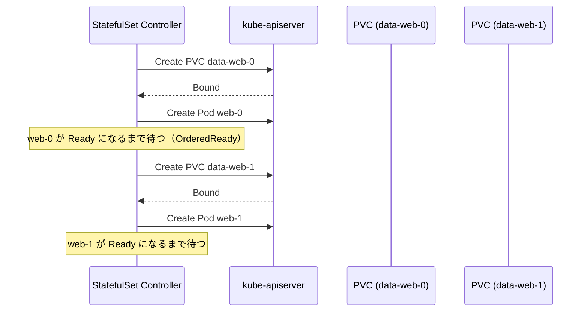

# StatefulSet

## 1. StatefulSet が必要な理由

Deployment は Pod をステートレスに扱う。Pod が再作成されるたびに異なる IP・異なるストレージを持つため、**状態を持つアプリケーション**（データベース、分散キャッシュ、メッセージブローカー等）には不向きだ。

StatefulSet は各 Pod に「安定したアイデンティティ」を与える。

| 特性 | Deployment | StatefulSet |
|---|---|---|
| Pod 名 | ランダムハッシュ付き（web-abc12） | 序数固定（web-0, web-1） |
| ネットワーク名 | 不安定（IP 変動） | 安定（Headless Service + DNS） |
| ストレージ | 共有 or 再作成 | 各 Pod が専用 PVC を保持 |
| 起動順序 | 並列 | 順序付き（OrderedReady） |
| 停止順序 | 並列 | 逆順（N-1 → N-2 → ... → 0） |

コードの定義より：

```
// StatefulSet represents a set of pods with consistent identities.
// Identities are defined as:
//   - Network: A single stable DNS and hostname.
//   - Storage: As many VolumeClaims as requested.
//
// The StatefulSet guarantees that a given network identity will always
// map to the same storage identity.
```

---

## 2. 型定義（StatefulSetSpec）

`staging/src/k8s.io/api/apps/v1/types.go`

```go
type StatefulSetSpec struct {
    Replicas            *int32                     // Pod 数（デフォルト 1）
    Selector            *metav1.LabelSelector      // Pod セレクタ
    Template            v1.PodTemplateSpec         // Pod テンプレート
    VolumeClaimTemplates []v1.PersistentVolumeClaim // 各 Pod の PVC テンプレート
    ServiceName         string                     // Headless Service の名前
    PodManagementPolicy PodManagementPolicyType    // OrderedReady | Parallel
    UpdateStrategy      StatefulSetUpdateStrategy  // RollingUpdate | OnDelete
    RevisionHistoryLimit *int32                    // 保持するリビジョン数（デフォルト 10）
    MinReadySeconds     int32                      // Ready 判定の最小秒数
    PersistentVolumeClaimRetentionPolicy *...      // PVC のライフサイクルポリシー
    Ordinals            *StatefulSetOrdinals       // 序数の開始値（デフォルト 0）
}
```

---

## 3. 安定したネットワーク ID（Headless Service）

StatefulSet は **Headless Service**（`clusterIP: None`）と組み合わせて使う。

```
StatefulSet: web
ServiceName: web-svc
Namespace: default

Pod web-0 → web-0.web-svc.default.svc.cluster.local
Pod web-1 → web-1.web-svc.default.svc.cluster.local
Pod web-2 → web-2.web-svc.default.svc.cluster.local
```

Pod が削除・再作成されても DNS 名は変わらない。他の Pod は常にこの DNS 名でアクセスできる。これが「ネットワークアイデンティティの安定性」の実体。

---

## 4. Ordinal（序数）と Pod 名の固定

Pod 名は `<statefulset-name>-<ordinal>` の形式で決まる。

- StatefulSet `web`、replicas=3 の場合 → `web-0`, `web-1`, `web-2`
- Pod `web-0` が削除されると、全く同じ名前 `web-0` で再作成される
- `spec.ordinals.start` で開始番号を変更可能（デフォルト 0）

型定義（`apps.kubernetes.io/pod-index` ラベル）:
```go
const (
    StatefulSetPodNameLabel = "statefulset.kubernetes.io/pod-name"
    PodIndexLabel           = "apps.kubernetes.io/pod-index"
)
```

---

## 5. VolumeClaimTemplates（PVC テンプレート）

StatefulSet の核心的な機能。各 Pod が自分専用の PersistentVolumeClaim を持つ。

```yaml
volumeClaimTemplates:
- metadata:
    name: data
  spec:
    accessModes: ["ReadWriteOnce"]
    resources:
      requests:
        storage: 10Gi
```

これにより：

```
web-0 → PVC: data-web-0 → PV（独立した物理ストレージ）
web-1 → PVC: data-web-1 → PV（独立した物理ストレージ）
web-2 → PVC: data-web-2 → PV（独立した物理ストレージ）
```

**重要**: PVC は StatefulSet のスケールダウン時にデフォルトで削除されない（Retain ポリシー）。これは意図的な設計で、誤ってデータを失うリスクを排除する。

削除ポリシーの制御（`persistentVolumeClaimRetentionPolicy`）:
```go
type StatefulSetPersistentVolumeClaimRetentionPolicy struct {
    WhenDeleted PersistentVolumeClaimRetentionPolicyType // Retain | Delete
    WhenScaled  PersistentVolumeClaimRetentionPolicyType // Retain | Delete
}
```

---

## 6. Pod 管理ポリシー

### OrderedReady（デフォルト）

```
スケールアップ:  web-0(起動 & Ready 待ち) → web-1(起動 & Ready 待ち) → web-2
スケールダウン: web-2(削除 & 終了確認) → web-1(削除 & 終了確認) → web-0
```

コードでの実装（`stateful_set_control.go:processReplica()`）:
- Pod が Ready でない場合 → `monotonic=true` なら次の Pod 処理を止める
- Pod が Terminating 中の場合 → 完了を待ってから次へ

```go
// If we have a Pod that has been created but is not running and ready
// we can not make progress.
if !isRunningAndReady(replicas[i]) && monotonic {
    return true, nil  // 処理を止める
}
```

### Parallel

全 Pod を同時に作成・削除する。Ready を待たない。
`monotonic=false` で `runForAll()` が全 Pod に対して `slowStartBatch()` で並列処理。

---

## 7. 更新戦略

### RollingUpdate（デフォルト）

高い序数の Pod から低い序数へ順番に更新。

```
replicas=5 の場合:
web-4 削除 → 新 web-4 起動・Ready → web-3 削除 → ... → web-0
```

**Partition**: カナリアリリースに使用。`partition=3` なら `web-3`, `web-4` だけが更新され、`web-0` ～ `web-2` は旧バージョンのまま。

```go
type RollingUpdateStatefulSetStrategy struct {
    Partition    *int32              // ここ以上の ordinal だけ更新
    MaxUnavailable *intstr.IntOrString // 同時に利用不可にできる Pod 数
}
```

### OnDelete

Pod を自動更新しない。ユーザーが手動で Pod を削除したときだけ、新しいバージョンで再作成される。細かい制御が必要な場合に使用。

---

## 8. Controller の処理フロー（updateStatefulSet）

`pkg/controller/statefulset/stateful_set_control.go`

```
UpdateStatefulSet(set, pods)
    │
    ├─ ListRevisions()         リビジョン履歴を取得・ソート
    │
    └─ performUpdate()
            │
            ├─ getStatefulSetRevisions()   currentRevision / updateRevision を決定
            │
            └─ updateStatefulSet()
                    │
                    ├─ 「replicas」リスト作成 (ordinal 0..N-1 の対応 Pod)
                    ├─ 「condemned」リスト作成 (ordinal >= replicas の過剰 Pod)
                    │
                    ├─ runForAll(replicas, processReplica)   スケールアップ・修正
                    └─ runForAll(condemned, processCondemned) スケールダウン
```

`processReplica()` の判断ロジック:

```
Pod が Failed/Succeeded  → 削除して次回 sync で再作成
Pod が未作成             → CreateStatefulPod()
Pod が Pending           → createMissingPersistentVolumeClaims()
Pod が Terminating       → monotonic なら待つ
Pod が Not Ready         → monotonic なら待つ
Pod の identity/storage 不一致 → UpdateStatefulPod()
```

---

## 9. ControllerRevision による履歴管理

StatefulSet は更新のたびに `ControllerRevision` オブジェクトを作成する（Deployment の ReplicaSet に相当）。

```
ControllerRevision: web-6d4b9c7 (revision=1, 旧 spec のスナップショット)
ControllerRevision: web-7f8a2d1 (revision=2, 現在の spec のスナップショット)
```

RollingUpdate 中、Pod が `currentRevision` の spec で動いているか `updateRevision` の spec で動いているかを RevisionHash ラベルで追跡する。

---

## 10. StatefulSet vs Deployment まとめ

```
Deployment
  └── Pod（ステートレス）
        名前: web-7d9f8c-xxxxx（ランダム）
        ストレージ: 共有 or なし
        ネットワーク: 不安定 IP
        目的: Web サーバー、API サーバー

StatefulSet
  └── Pod（ステートフル）
        名前: web-0, web-1, web-2（固定）
        ストレージ: data-web-0, data-web-1（専用 PVC）
        ネットワーク: web-0.svc.ns.svc.cluster.local（固定 DNS）
        目的: データベース、Kafka、Elasticsearch
```

## 11. OrderedReady での Pod 起動シーケンス（Mermaid）



---

## 12. 設計の Why（なぜそう作られているのか）

**Q: なぜ OrderedReady がデフォルトなのか？**

DB クラスタのプライマリ/レプリカ構成では起動順序が重要なため。
例えば MySQL のプライマリ（web-0）が Ready になってからレプリカ（web-1）が接続しに行かないと、
レプリカが接続先を見つけられず失敗する。
OrderedReady により「前の Pod が Ready になってから次を起動する」という順序が保証される。

**Q: なぜ Headless Service が必要か？**

通常の Service は Pod をランダム選択するが、DB クライアントはプライマリ/レプリカを DNS 名で直接指定する必要があるため。
Headless Service（`clusterIP: None`）を使うと `web-0.web-svc.default.svc.cluster.local` という
固定 DNS 名が各 Pod に割り当てられ、特定の Pod に直接アクセスできる。

**Q: なぜ PVC を StatefulSet が管理するのか？**

Pod 再作成時に同じ PVC を自動バインドすることでデータ永続性を保証するため。
また、スケールダウン時に PVC を自動削除しない（デフォルト Retain ポリシー）ことで、
誤ってデータを消すリスクを排除できる。PVC の削除は明示的な操作が必要であり、
意図しないデータ消失が起きない。

---

## 13. 障害・運用観点

### よくある障害パターン

| 症状 | 根本原因 | 調査コマンド |
|---|---|---|
| Pod が Pending（PVC が Bound されない） | StorageClass が存在しない・PV の容量不足・アクセスモード不一致 | `kubectl describe pvc data-web-0` で Events 確認 |
| スケールダウン後 PVC が残り続ける | 意図的な Retain ポリシー（デフォルト動作） | `kubectl get pvc` で確認、不要なら手動削除 |
| OrderedReady でロールアウトが止まる | ある Pod が Ready にならない（ヘルスチェック失敗等） | `kubectl describe pod web-0` + `kubectl logs web-0` |
| web-0 削除後 Pod が再作成されない | PVC が見つからない・StorageClass が変更された | `kubectl get pvc` + `kubectl get pv` で状態確認 |

### よく使う調査コマンド

```bash
# StatefulSet の状態確認
kubectl describe statefulset <name>

# 特定 Pod の再作成（データは PVC に保持される）
kubectl delete pod web-0

# PVC の確認（削除は慎重に）
kubectl get pvc -l app=<name>

# ロールアウト状態確認
kubectl rollout status statefulset/<name>

# 危険：データ消失するコマンド（実行前に必ず確認）
# kubectl delete pvc data-web-0
```

### 主要 Prometheus メトリクス

| メトリクス名 | 意味 | アラート基準例 |
|---|---|---|
| `kube_statefulset_status_replicas_ready` | Ready な Pod 数 | `kube_statefulset_spec_replicas` との差異でアラート |
| `kube_statefulset_status_replicas_current` | 現在の世代で動いている Pod 数 | `spec_replicas` との差が長時間続くでアラート |
| `kube_statefulset_status_update_revision` | 更新中リビジョン（ロールアウト中か確認） | 長時間変化しない場合はロールアウトが止まっている |
| `kube_persistentvolumeclaim_status_phase` | PVC の状態（Bound/Pending/Lost） | `Pending` or `Lost` でアラート |

---

## 参照ソース

| ファイル | 内容 |
|---|---|
| `pkg/controller/statefulset/stateful_set.go` | StatefulSetController 定義 |
| `pkg/controller/statefulset/stateful_set_control.go` | UpdateStatefulSet フロー |
| `pkg/controller/statefulset/stateful_pod_control.go` | Pod・PVC の作成・削除 |
| `staging/src/k8s.io/api/apps/v1/types.go` | StatefulSetSpec 型定義 |
